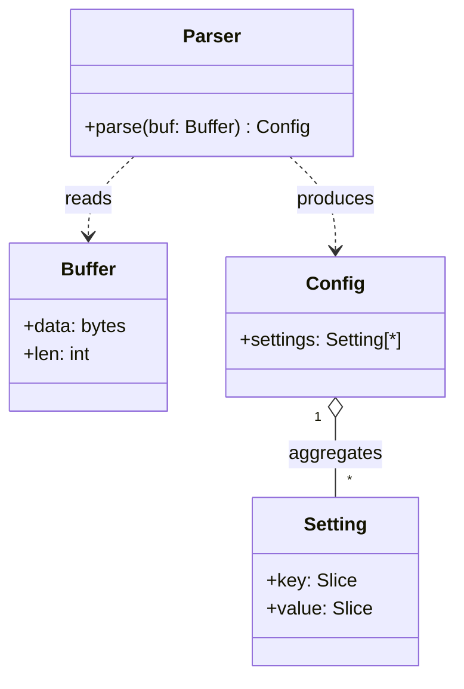
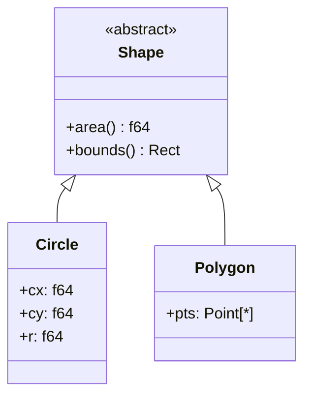
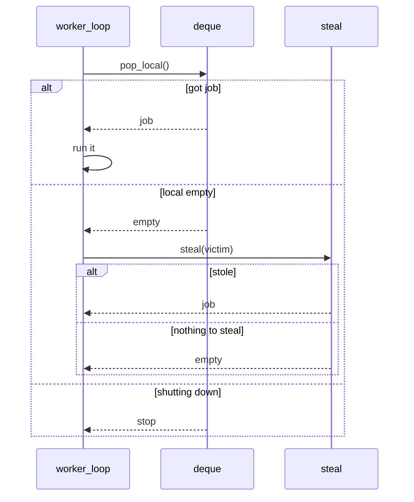
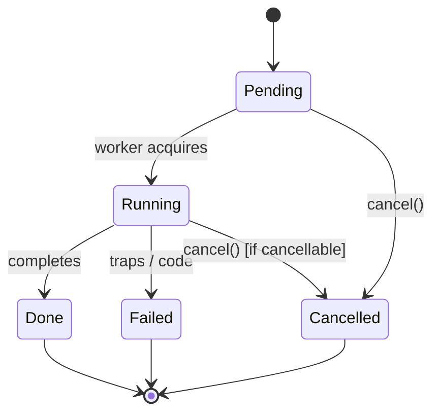

# The Moonlift Design Bible

## From sketch to type forest to machine: a complete method for designing software the explicit way

**Status:** design canon — methodology, theory, and practice in one volume
**Prerequisites:** none beyond curiosity; Moonlift syntax is introduced as needed
**Promise:** by the end, you will be able to take a vague idea, sketch it as diagrams, transcribe the diagrams into a checked dual tree of products and protocols, evaluate that design against the best general theory of software design we have (Ousterhout's), and arrive at a system where implementation is transcription.

---

## How to read this book

This book is six books.

```text
Book I    FOUNDATIONS       what design is; the two structures; the design algebra
Book II   DEPTH             Ousterhout's philosophy, translated into Moonlift
Book III  FROM UML          how every UML diagram maps onto the dual tree
Book IV   THE METHOD        the twelve-step procedure, idea → checked design
Book V    THE WORKED CASE   a job scheduler, carried end to end
Book VI   THE CANON         anti-patterns, red flags, review checklists, doctrine
```

Read Book I even if you know Moonlift — it fixes the vocabulary everything else uses. Books II and III can be read in either order. Book IV is the procedure you will actually run on real problems; Book V shows the procedure running; Book VI is what you pin to the wall.

A note on stance. This book takes positions. It says unions are not a design primitive, that inheritance dissolves into protocols, that most diagrams rot because they were never checked. These positions are argued, not asserted — but they are positions, and the book is more useful if you argue back while reading.

---
---

# BOOK I — FOUNDATIONS

---

## Chapter 1: The two structures every system has

Every program — every program, in every language, since the beginning — is two things at once:

```text
1. A TYPE FOREST    what data exists, what shapes it takes, what invariants hold
2. A CONTROL GRAPH  what happens, in what order, under what conditions
```

For sixty years, languages gave us a type system for the first structure and nothing for the second. We typed our data — `int`, `struct`, `List<T>` — and left our control flow untyped: `goto`, `break`, `return`, exceptions, callbacks. Then we spent decades inventing crutches to win back the lost safety: monads to type effects, `Result<T,E>` to type failure, async/await to type suspension, state-machine compilers to type protocols. Every crutch encodes control *as data*, ships the data somewhere, and decodes it back *into control* — paying in allocations, dispatch, and obscurity at every step.

Moonlift's founding move is to give the second structure its own type system, natively:

```text
region  = a typed control fragment with declared, named, typed exits
cont    = the type of one exit: a name plus a payload product
block   = a named internal state carrying a typed product
jump    = a typed state transition, totally assigning the target's product
emit    = compile-time graph splicing: compose a sub-machine, fill its exits
func    = a region sealed to one implicit exit (return), forming an ABI boundary
```

A region signature reads like this:

```moonlift
region parse_number(p: ptr(u8), n: index, i: index;
    ok(value: f64, next: index)
    | err(pos: index, code: i32))
```

The semicolon is the most important character in the language. **Before it: the data flowing in. After it: the control flowing out.** Before it is a product list, so parameters are comma-separated; after it is a sum of exits, so alternatives are `|`-separated. Each exit payload is itself a product. The compiler checks the control graph the way it checks the data:

```text
every declared continuation must be filled at every emit site
every fill must match the continuation's payload types
every jump must totally assign its target block's parameters
every path must terminate explicitly — there is no fallthrough
```

When both structures are typed, design changes character. The design is no longer a diagram beside the code, a spec above the code, or a convention around the code. **The design is the declaration graph itself** — the type forest plus the region tree — and the compiler checks the two against each other continuously. That is the thesis of this entire book, and everything else is consequences.

This includes memory. A region signature is not merely a control interface; it is the place where access facts become visible. A continuation can grant a lease, deny access, prove a buffer shape, or expose that a handle was stale. The declaration already tells the caller what may be touched and what must be handled before any body is read.

---

## Chapter 1.5: The VM stack view

The two-structure thesis is the foundation: every program has a type forest and
a control graph. But there is a second practical lens that makes large systems
snap into focus:

```text
All serious programs become stacks of virtual machines.
```

Not one giant VM with one universal bytecode. A stack of small machines:

```text
source VM
    consumes source text/bytes/tokens
    produces syntax or semantic IR

semantic VM
    consumes typed IR
    produces lowered IR

runtime VM
    consumes lowered bytecode/ops
    produces buffers, commands, reports, events, or machine code
```

This is not an argument for slow interpreters. It is an argument for making the
instruction language of each layer explicit. A VM is simply a machine with:

```text
an instruction language
a cursor, stream, or program counter
an environment/store product
typed transitions
diagnostics
ownership rules
an output language or materialized buffer
```

Once this is visible, many "API design" problems become compiler problems with
better answers. A UI toolkit is not a bag of widgets; it is a compiler from
authored UI bytecode to layout, render, hit-test, and event bytecode. A parser is
a VM from bytes to syntax products. A renderer is a VM from view ops to backend
commands. A Lua bridge is a VM boundary between dynamic host values and semantic
handles. A compiler is a stack of VMs whose stages consume and produce typed IR
languages.

The design question changes from:

```text
What objects and methods should this subsystem expose?
```

to:

```text
What bytecode does this layer consume?
What bytecode, stream, report, or buffer does it produce?
What validates the input language?
Who owns the bytes?
Can the input be borrowed?
What is the environment product?
Where are the phase/cache boundaries?
What can be retained between runs?
What diagnostics can this VM emit?
Can this stage run without the authoring language?
```

This lens is why PVM works: it made compiler phases into lazy machines over
ASDL products. It is why LLPVM works: it makes that machine boundary concrete as
borrowed bytecode images, native handles, streams, buffers, recordings, and C
ABI seals. It is why MLUI should remain a rich compiler while still emitting a
dense borrowed image for the native UI VM.

The VM-stack view does not replace the dual tree. It sharpens it:

```text
TYPE FOREST    names the instruction languages, stores, handles, buffers
CONTROL GRAPH  names the VM transitions, phase exits, validation outcomes
BYTECODE       is the portable product at a machine boundary
```

Design law:

```text
When a subsystem has repeated execution, retained state, diagnostics,
incremental invalidation, or a performance boundary, identify its VM and
instruction language before designing public APIs.
```

Do not start with wrappers around objects. Find the VM stack first.

### LLPVM as the canonical operational form

LLPVM is not an exception to the method and not just an optimization project. It
is the concrete low-level form of this chapter:

```text
Bible concept              LLPVM realization
---------------------------------------------------------------
type forest                Language, Type table, World, Value, Stream, Buffer, Phase
control graph              native regions over streams and stores
instruction language       LLPV bytecode records
machine boundary           borrowed immutable image
environment/store product  LlVm
durable identity           Ll*Ref handles
temporary access           resolver regions and leases
phase boundary             LlPhase + LlPhaseKey
incremental state          Recording + CacheEntry
materialized output        LlBuffer
diagnostics                LlDiagnostic / llpvm_status at ABI seals
portable artifact          C blob / header; WebAssembly is downstream C compilation
```

When the Bible says "find the VM stack", LLPVM is the standard answer for the
layer that must become portable, incremental, and native. A higher-level system
may still have its own rich compiler-shaped frontend, but if it needs a stable
runtime boundary, the boundary should look like LLPVM: dense instruction image
in, typed native machine, handles/streams/buffers/reports out.

---

## Chapter 2: What complexity is, and how explicitness attacks it

Before designing anything, we need a theory of what we are designing *against*. The best available theory is John Ousterhout's, from *A Philosophy of Software Design*, and it is worth restating in compressed form because Moonlift turns out to be, almost point for point, a language-level answer to it.

Ousterhout defines complexity operationally: complexity is anything about a system's structure that makes it hard to understand or modify. It shows up as three symptoms:

```text
CHANGE AMPLIFICATION   a simple change requires edits in many places
COGNITIVE LOAD         how much a developer must hold in their head to work safely
UNKNOWN UNKNOWNS       it is not even clear what must be known or touched
```

And it has, in his account, exactly two causes:

```text
DEPENDENCIES   code that cannot be understood or changed in isolation
OBSCURITY      important information that is not obvious from the code
```

Hold those two causes up against the discipline Moonlift embodies — *explicit programming* — and the alignment is exact. Explicit programming is the refusal of implicitness: every distinction that matters to behavior must appear in the source as a typed value, a named transition, or a declared protocol, where the compiler, the IDE, and the human can all see it. That is a frontal assault on **obscurity**. Obscurity is precisely meaning that lives where tooling cannot reach — in runtime dispatch, in conventions, in compiler-generated state machines, in the gap between what the signature says and what the function does.

Dependencies cannot be eliminated — modules must talk — but they can be **declared and checked**. In Moonlift, every control dependency is a typed edge: an emit site that names which continuation goes where. A caller cannot "forget" an outcome, because an unfilled continuation is a compile error. This converts the worst symptom, unknown unknowns, into the best kind of known: a red squiggle. Consider the canonical obscure signature:

```text
fn authenticate(creds) -> Result<User, AuthError>
```

It looks explicit. It is not. *Account locked* and *invalid credentials* are both `AuthError`; whether the caller distinguishes them is invisible; whether rate-limiting exists at all is invisible. Now the Moonlift form:

```moonlift
region authenticate(creds: ptr(Credentials);
    success(user_id: u64)
    | invalid
    | locked(unlock_at: i64)
    | rate_limited(retry_after: i32))
```

Four outcomes, four payloads, and every caller is forced — typed, totally — to say what each one means locally. The signature has stopped lying. Multiply that by every decision point in a system and you have the explicit-programming bet: **most software complexity is hidden control, and a type system for control un-hides it.**

One more Ousterhout idea frames the whole book: the distinction between **tactical** and **strategic** programming. Tactical programming optimizes for the next working feature; each shortcut adds a little complexity; the complexity compounds; velocity collapses. Strategic programming treats design as the primary deliverable and working code as its byproduct. The method in Book IV — *signatures before bodies, always* — is strategic programming made mechanical. You cannot tactically smuggle a design decision into a body you have not yet been allowed to write.

---

## Chapter 3: The design algebra — products, protocols, regions

Moonlift design uses two semantic type forms and one connective. Learn these three words and you have the whole vocabulary.

### 3.1 Product — data that exists together

A product is a group of facts that coexist. Structs are products:

```moonlift
struct Cursor   byte: index, line: index, column: index end
struct Buffer   data: ptr(u8), len: index end
struct SourceSpan  file_id: u32, start: index, len: index end
```

But products hide in four other places, and a designer must see all five:

```text
struct fields            = stored product
function parameter list  = input product
function return          = output product
block parameter list     = STATE product
continuation payload     = EXIT product
```

The product test: *do all the fields exist at the same time? can a consumer use them without first choosing a semantic branch? is this a concrete memory shape?* If yes — product. A product never asks the consumer to choose. It simply exists.

### 3.2 Protocol — choices consumed by control

A protocol is a set of named, typed continuations: all the ways a machine can hand off control, each carrying an exit product. The protocol test: *will some consumer branch on this? do the branches carry different payloads? would a boolean, status code, or result object hide what can happen?* If yes — protocol.

```moonlift
region recv_i32(ch: ptr(Channel);
    got(value: i32)
    | empty
    | closed
    | parked(waiter: ptr(Waiter)))
```

A protocol is not returned, not allocated, not a runtime object. It is a set of **control obligations** that the caller discharges at the emit site:

```moonlift
emit recv_i32(ch;
    got    = handle_value,
    empty  = try_other_work,
    closed = stop_worker,
    parked = suspend_task)
```

Read that emit carefully, because the perspective shift is the whole paradigm. The caller is not inspecting a result. The caller is **wiring**: "here is what each of your exits means in my machine." The region selects exactly one exit at runtime; the wiring was checked at compile time; nothing was boxed, tagged, returned, or switched.

### 3.3 Region — the connective

```text
region R(input_product ; protocol)
    consumes the input product
    runs a control machine (blocks, jumps, emits)
    selects EXACTLY ONE continuation in the protocol
    passes it an exit product
```

A region is *not* `Product → Union`. A region is `Product + Protocol → one selected continuation with a product payload`. The difference is not pedantry — it is where the entire cost model and the entire checking model come from. Because the protocol is supplied by the caller and consumed by a jump, composition is graph splicing (`emit` merges the callee's CFG into the caller's — no call, no frame, no return address), and checking is structural (the splice must type-fit).

The payload is also where newly known facts appear. A `borrowed(state: lease ptr(VoiceState))` continuation does not merely carry an address; it declares that this path has resolved a handle, granted temporary access, and excluded the stale/missing paths. Region signatures are therefore control contracts and memory contracts at the same time.

### 3.4 Function — the seal

A function is a sealed region with one implicit continuation:

```moonlift
func add(a: i32, b: i32): i32         -- region add(a: i32, b: i32; return(result: i32))
```

Sealing buys an ABI: callable from Lua, C, other modules; a symbol; a recursion boundary. The recursion boundary matters mechanically: a function call gives you a stack frame for free. A recursive descent packaged as functions can call a child and resume in the parent because the call stack remembered the parent continuation. A flat region has no such frame; if you flatten recursive descent into one dispatcher, you must build the stack product yourself.

Sealing costs the protocol: multiple outcomes must be squeezed back into one return product, which is exactly how status codes, result objects, exceptions, and callback registries get invented. Hence the design law that recurs throughout this book:

> **Compose locally with regions. Recurse and cross ABIs with functions.**

A function is product-to-product. That is a wonderful shape at an ABI boundary or recursion seam, and a smuggler's shape *inside* local protocol-rich control.

### 3.5 Lua — the family generator

Moonlift source is deliberately monomorphic: no generics, no type parameters, no angle brackets. All genericity lives one level up, in Lua, where a **factory** — an ordinary Lua function — builds and returns concrete, distinctly named Moonlift declarations:

```lua
local function expect_byte(tag, byte, err_code)
    return moon.region{ byte = byte, code = err_code }[[
    expect_@{tag}(p: ptr(u8), n: index, pos: index;
        ok(next: index)
        | err(pos: index, code: i32))
    entry start()
        if pos >= n then jump err(pos = pos, code = @{code}) end
        if as(i32, p[pos]) == @{byte} then jump ok(next = pos + 1) end
        jump err(pos = pos, code = @{code})
    end
    end ]]
end
```

`@{x}` splices a typed ASDL value — a type, a constant, a fragment — never a string. The parser sees a complete monomorphic program. Factories are not an implementation convenience; they are the design representation of a *family* of machines, and Book II will show that they quietly resolve one of Ousterhout's hardest trade-offs.

### 3.6 LuaBridge — the dynamic host boundary

Lua plays two roles in Moonlift, and confusing them is a design bug.

```text
Lua as staging language
    builds declarations, factories, quotes, and modules

LuaJIT as runtime object space
    owns stack slots, Lua objects, registry references, and protected calls
```

The first role is beautiful Lua: callable tables, factories, splices, modules.
The second role is a foreign runtime boundary. It must be treated like every
other serious Moonlift boundary: with typed products, handles, ownership
obligations, and named exits.

That boundary is **LuaBridge**.

```text
lua_raw          raw extern pins, unsafe and internal
lua_bridge_model typed boundary facts and protocol signatures
lua_bridge       implementations that may touch lua_raw
```

The doctrine is simple:

```text
Raw Lua C API calls are allowed.
Raw Lua C API calls are not the design.
LuaBridge regions are the design.
```

LuaJIT owns Lua object memory. Moonlift owns registry-reference obligations.
A stack index is borrowed position, not a durable value. A registry integer is
an implementation field, not ownership. A Lua string pointer is borrowed memory,
not a buffer. A protected-call status code is not the error model.

The typed bridge names those facts:

```moonlift
handle LuaStateRef : u32 invalid 0
    target LuaStateRecord
end

handle LuaRef : u32 invalid 0
    target LuaRefRecord
end

struct LuaStackMark
    top: i32,
end

struct LuaStackRange
    first: i32,
    count: i32,
end
```

The key ownership type is:

```moonlift
owned LuaRef
```

`LuaRef` is durable identity for a Lua value retained in the registry.
`owned LuaRef` is the exactly-once obligation to release or transfer that
registry reference. If a bridge protocol accepts an owned ref and fails before
proving discharge, the failure exit carries `ref: owned LuaRef` back to the
caller. Error handling cannot erase cleanup authority.

This is not extra ceremony. It is Moonlift applying its own law at the LuaJIT
border:

```text
Lua stack effects are marked, restored, checked, or exposed as ranges.
Lua calls are protected.
Lua errors become typed continuations.
Lua tables are imported by named semantic protocols.
Lua userdata is decoded as controlled proxies or rejected as foreign.
Only LuaBridge may normally use lua_raw.
```

So the host may remain poetic, but the runtime bridge must be explicit. Lua is
where genericity lives; LuaBridge is where LuaJIT's dynamic runtime facts stop
being ambient and become Moonlift facts.

### 3.7 Unified ASDL — one shape language for data and control

This is the unifying point: Moonlift is **ASDL generalized from data into
control**.

Classic ASDL names products and sums of stored data. Moonlift keeps that, then
uses the same product/sum vocabulary at executable boundaries:

```text
struct = named product
union  = named sum
region = named machine from an input product to an output protocol
block  = named state product
emit   = checked composition of protocol sums
func   = sealed product-to-product ABI edge
```

The syntax mirrors the algebra. Product positions accept product shapes; sum
positions accept sum shapes:

```moonlift
struct ParseInput
    p: ptr(u8),
    n: index,
    i: index,
end

union ParseExit
    ok(value: f64, next: index)
  | syntax(pos: index, code: i32)
  | truncated(pos: index)
end

region parse_number(ParseInput; ParseExit)
```

That last line is not a new abstraction layer. It is the same declaration graph
written with names instead of anonymous lists:

```moonlift
region parse_number(p: ptr(u8), n: index, i: index;
    ok(value: f64, next: index)
  | syntax(pos: index, code: i32)
  | truncated(pos: index))
```

Statement boundaries are part of that explicitness. A newline in statement
position may continue an infix expression or separate a place from its
assignment `=`, but it may not introduce a postfix call, index, aggregate-call,
or field continuation. Moonlift must not silently join `x = value` with a
following `(callee)(arg)` and invent a hidden call edge. If an expression is
multiline beyond infix/assignment continuation, it is multiline inside an
explicit delimiter or control construct. The source text should keep the same
control shape a reader and `rg` see.

`ParseInput` expands in a product-list position because it is a product.
`ParseExit` expands in a protocol position because it is a sum. The runtime
meaning is still different: a stored `union` is a tag and payload; a region
protocol is direct control, selected by `jump`. But the **shape language** is
shared.

This is why the declarations are the architecture. You are not separately
inventing an AST schema, an event schema, a callback interface, a state-machine
diagram, and an ABI. You are naming one forest:

```text
product forest       structs, params, block states, continuation payloads
sum/protocol forest  unions, region exits
control graph        regions, blocks, jumps
composition graph    emits and fills
seal graph           functions and externs
```

The discipline is still explicitness. Use named products and named protocols
when the name is a real shared concept (`ParseInput`, `ParseExit`, `DrawIter`,
`DrawFact`). Inline the lists when the vocabulary is local. A named shape should
reduce duplication and reveal architecture, not hide a one-off signature behind
an alias.

### 3.7 The algebra, on one card

```text
Product      = data that exists together; comma-separated fields
Sum          = alternatives; `|`-separated variants
Protocol     = named alternatives of control; a control sum
Region       = input product + output protocol → selected continuation payload
Function     = sealed product-to-product region with one implicit continuation
Block        = named state carrying a product
Jump         = typed state transition
Emit         = graph composition by protocol filling
Switch       = explicit dispatch over an encoded fact, inside a consumer region
Lua factory  = generator of concrete products, sums, protocols, regions, functions
```

---

## Chapter 4: The death of the semantic union

This chapter is the doctrinal heart of Moonlift design, and the single largest departure from how typed-language designers are trained to think. It deserves its own chapter because everyone gets it wrong the first time — usually by producing a beautiful algebraic-data-type design and then wondering why it fights the language.

### 4.1 The seduction

ML taught us: *every "or" is a sum type*. The connection is open **or** closed → `union ConnState`. The parse succeeded **or** failed → `union ParseResult`. The event is a key **or** a mouse move → `union Event`. Write the union, return the union, switch on the tag. Fifty years of language design says this is the height of rigor.

Moonlift's stricter doctrine: look at what a union actually *is*. A tag plus one payload shape, whose entire reason to exist is that some later consumer will inspect the tag and branch. Its semantic content is not data. **It is delayed control.** Boxing it buys you:

```text
tag storage + payload storage + construction + later destruction
+ a switch + an indirection
```

— all to move a branch from the place where the fact was known to a place later, with the compiler unable to see that the producer's "or" and the consumer's switch are the same decision. The refined doctrine:

```text
There are products.
There are protocols.
There are no semantic unions.
```

The old rule "every *or* is a sum" becomes: **every *or* is presumed to be a protocol.** If there is no dispatch, there is no "or." If there is dispatch, the dispatcher gets a name and a region signature.

### 4.2 The interrogation

For every union-shaped thing in a draft design, ask three questions in order.

**Q1 — Is it consumed immediately after being produced?** Then it is not data at all. Delete it. The producer is a region with a protocol; the consumer fills the continuations at the emit site. The "union" was a branch wearing a box.

```moonlift
-- before: func parse(...): ParseResult     ... switch result ...
-- after:
region parse(...;
    ok(value: f64, next: index)
    | err(pos: index, code: i32))
```

**Q2 — Does it genuinely need to be stored** — queued, pooled, serialized, kept in an array? Then store an **encoded fact** (a product carrying a kind byte and payload records) and name the **consuming region** that gives it meaning later:

```moonlift
struct ExprRef   kind: u8, index: u32 end        -- encoding: a product

struct IntLitExpr  value: i64 end
struct NameExpr    symbol: u32 end
struct CallExpr    fn: ExprRef, args_data: ptr(ExprRef), args_len: index end

region visit_expr(ast: ptr(Ast), e: ExprRef;     -- meaning: a protocol
    int_lit(e: ptr(IntLitExpr))
    | name(e: ptr(NameExpr))
    | call(e: ptr(CallExpr))
    | invalid(code: i32))
```

The kind byte is a fact, and facts are fine. The mistake is treating the tag *as the design*. The design is `visit_expr`. Events, AST nodes, render commands, wire messages — all stored as products, all *meant* by their consumers.

**Q3 — Is there a tag field with no identifiable consuming region?** Delete it. A stored choice with no named future consumer is speculation, and speculation is where unknown unknowns breed. Add the tag back the day its consumer protocol exists.

### 4.3 Why this matters beyond taste

Three concrete payoffs. First, **performance is structural, not heroic**: no boxes means no allocations on the decision path, no tags means no mispredicted switches downstream, and emit-splicing means ten layers of composition compile to one flat CFG. Second, **exhaustiveness moves to the right place**: instead of every consumer everywhere defensively switching on a tag (and silently ignoring `kind == 2` when — not if — it appears), exactly one consumer region owns the encoding, and every *caller of that region* is forced to fill every exit. Third — and this is the bridge to Book II — concentrating each encoding behind one consumer region is **information hiding** in its purest form. Which brings us to Ousterhout.

---
---

# BOOK II — DEPTH: Ousterhout's philosophy, translated

*A Philosophy of Software Design* is the best general theory of software design in print, and it was written about conventional languages. This book translates it concept by concept into Moonlift terms — and finds, surprisingly often, that what Ousterhout could only recommend as discipline, Moonlift can enforce as types, measure as counts, or move to compile time.

---

## Chapter 5: What a module is, and depth made measurable

Ousterhout's central image: a module is an interface stacked on an implementation, and the best modules are **deep** — a small, simple interface concealing a large, powerful implementation. The interface is the *cost* a module imposes on the rest of the system (everyone who uses it must learn it); the implementation is the *benefit* it provides. A **shallow** module has an interface nearly as complex as what it hides — all cost, little concealment. His most quoted example of depth is the Unix file I/O interface: five small calls hiding caching, scheduling, permissions, devices, and decades of machinery.

Translate to Moonlift:

```text
module          ≈ a region (or a sealed function, or a Lua factory)
interface       = the SIGNATURE: input product + continuation protocol
implementation  = the blocks, jumps, and emitted sub-machines behind it
```

And now something happens that cannot happen in prose-philosophy: **depth becomes measurable.** The interface cost of a region is countable —

```text
cost(R) = |input params| + |continuations| + Σ |payload fields| (+ invariants the caller must know)
```

— and the implementation magnitude is countable too: blocks, emits, and the transitive size of the spliced sub-machine tree. A deep region has a small signature in front of a large spliced CFG:

```moonlift
region parse_value(L: ptr(lua_State), p: ptr(u8), n: index, i: index;
    ok(next: index)
    | err(pos: index, code: i32))
```

Two continuations. Behind them: a complete recursive-descent JSON machine — strings, numbers, escapes, nesting — spliced flat. That is depth, and the protocol is where you read it.

The shallow case is equally legible. Ousterhout's *pass-through method* red flag — a method that does almost nothing but call a similar method — appears in Moonlift as the **pass-through region**: a region whose protocol is isomorphic to the protocol of the single region it emits, forwarding every continuation unchanged, adding no decision, no state, no narrowing. Its signature costs the reader everything its implementation provides: nothing. Delete it; let callers emit the inner region directly. (Forwarding *some* continuations upward while consuming others locally is not pass-through — that is composition. The smell is total isomorphism.)

There is one Moonlift-specific nuance Ousterhout's framework needs amending for: a *wide* protocol is not automatically a *shallow* one. `authenticate` above has four continuations, and that is the right number, because the four outcomes are genuinely distinct *to its callers*. Width is cost only when it exposes distinctions the consumer does not need — which is the subject of the granularity rule:

> **The protocol belongs to the consumer.** If the caller of `parse_value` does not care whether the value was a string, number, array, or object, do not give it `string/number/array/object/literal` exits. Collapse them to `ok`. Exposing unconsumed distinctions is the protocol form of a leaky interface; collapsing them is, literally, the act of deepening the module.

That single rule — design the protocol from the consumer's chair, not the producer's — does more for module depth in Moonlift than any other habit.

---

## Chapter 6: Information hiding, and where the secrets live

Ousterhout (channeling Parnas): a deep module is deep because it *hides information* — design decisions embedded in the implementation that do not appear in the interface. The corresponding sin is **information leakage**: a design decision reflected in multiple modules, so that changing the decision means changing all of them. Leakage is, in his words, among the most important red flags in software design.

In Moonlift, the secrets have specific names. What a well-designed region hides:

```text
the ENCODING        kind bytes, layout, indices, ring arithmetic, bit packing
the STATE SHAPE     its blocks and their products
the SUB-MACHINE     which regions it emits and how it wires them
the ALGORITHM       scan strategy, retry policy, ordering tricks
```

What it exposes: the input product and the protocol. Nothing else.

Now watch how the union doctrine of Chapter 4 turns out to *be* information hiding. The classic leakage disaster in conventional code is the scattered switch: a `kind` field consumed by switch statements in nine files. The encoding — what the kinds are, what each payload means, what kind 7 was supposed to be — has leaked into nine modules; adding a variant means a nine-file change the compiler only partially polices. The Moonlift fix is structural: **exactly one consumer region owns each encoding.** `visit_expr` owns `ExprRef.kind`. Every other piece of code in the system goes through `visit_expr`'s protocol and never sees a number. Add a variant: the encoding owner gains a continuation, and the compiler then walks you — emit site by emit site, totally — through every caller that must now say what the new case means locally. Change amplification still happens (it must — the system genuinely has a new case), but it is *enumerated by the type checker* instead of discovered in production. That is leakage converted into a checklist.

A second leakage channel Ousterhout warns about is the back door: state shared outside the interface — globals, side tables, ambient context. The Moonlift hygiene is the **block-product rule**: a block's parameter list is its *complete* state. If a body wants a mutable variable that survives a jump, that variable is a missing block parameter; if a factory wants shared mutable Lua state between instantiations, that is a back door between machines. State that is not in a product is state the design is hiding *from itself*.

Finally, **temporal decomposition** — Ousterhout's red flag for systems whose module structure mirrors the order of execution ("read module, parse module, write module… and now the file-format knowledge lives in two of them"). The Moonlift answer comes from the compiler pattern: layer boundaries must be *knowledge* boundaries, not chronology. Each phase or region exists because a real question gets answered there — bytes become tokens, tokens become trees, trees become positioned facts — and each piece of knowledge has exactly one home. The test for any proposed region named like a step ("phase2", "post_process", "finish_setup"): *what does the machine know after this region that it did not know before?* If you cannot answer with a typed product or a protocol selection, the region is a time slice, not a module — fold it into the place that owns the knowledge.

---

## Chapter 7: Define errors out of existence — the protocol way

One of Ousterhout's most provocative chapters argues that exceptions are a disproportionate complexity source, and that the best response is not better handling but **fewer exceptions**: redefine semantics so the "error" case is not an error (his example: `unset` of a missing variable simply does nothing; substring slicing out of range simply clamps), mask errors low, aggregate the rest high. Moonlift gives each of these moves a typed form — and adds one of its own.

**Move 1 — Normalize the outcome.** In an exception world, "queue empty" must either throw or hide in a nullable return. In a protocol world it is just a named, ordinary exit:

```moonlift
empty
```

Nothing about `empty` is exceptional — it is one of the things `recv` *does*, listed beside `got` with equal typographic and semantic weight. A large fraction of what conventional code calls error handling is, in Moonlift, simply… continuations. The pejorative category dissolves.

**Move 2 — Delete the continuation by strengthening the input.** The genuinely Ousterhoutian move is making the case *impossible*, and in Moonlift that is performed on the signature, visibly. An "index out of range" exit disappears when the parameter becomes a bounds-carrying `view(T)` and the loop is driven by its length. An `oom` on every node-allocation disappears when allocation is restructured: reserve once, up front —

```moonlift
region reserve_bytes(arena: ptr(Arena), n: index;
    ok(p: ptr(u8), len: index)
    | oom
    | invalid(code: i32))
```

— and every subsequent bump-allocation inside the reserved span is infallible, so dozens of downstream protocols each lose an exit. The same move applies to memory identity: a nullable pointer result disappears when the public value is a handle and the access operation is a resolving region whose successful exit grants a lease. Downstream code no longer checks "is this pointer stale?" because stale was one named continuation at the boundary, and the `borrowed` continuation carries the access fact. **Count your continuations; then go redesign your products until some of them die.** That sentence is "define errors out of existence" stated as a Moonlift design exercise, and the deletion is auditable in the diff: the signature literally gets shorter.

**Move 3 — Mask low, aggregate high, in the wiring.** Masking is filling a continuation with a local recovery block (`err = retry_once`). Aggregation is *forwarding*: `syntax = syntax` at an emit site maps the child's exit onto the parent's same-typed exit, and the error channel flows up an arbitrarily deep pipeline as compile-time wiring — zero code, zero boxing, no try/catch syntax, no unwinding machinery. This is what checked exceptions wanted to be: the throws-clause is the protocol, declaring it is mandatory, and discharging it is one identifier at one emit site rather than ceremony at every level.

**Move 4 — and crashing.** Ousterhout's final option — just crash, for errors not worth handling — maps to the `invalid(code: i32)` convention on encoding consumers and to top-level fills that trap. The design value is that *even the crash is a named exit*: the decision to not-handle was made visibly, at a wiring site, by the caller, instead of implicitly by an uncaught exception three layers away.

---

## Chapter 8: Pull complexity downward; push variation upward

Ousterhout: it is more important for a module to have a simple interface than a simple implementation — when complexity is unavoidable, the module should absorb it so its many callers don't, because the implementor suffers once while callers suffer forever. His prime suspect for complexity-pushed-upward is the **configuration parameter**: every knob a module exports is a decision it forced its users to make, usually because the implementor didn't want to make it.

Moonlift sharpens this into a two-direction rule, because Moonlift has *two* upward directions — toward the caller, and toward build time:

```text
PULL DOWNWARD into the region:
    awkward cases, retries, clamping, normalization, partial-progress
    bookkeeping — anything that would otherwise widen the protocol or
    burden every emit site.

PUSH UPWARD into Lua — but to BUILD TIME, not to the caller:
    genuine variation (element types, capacities, byte targets,
    platform calls, feature selection) becomes a FACTORY ARGUMENT,
    decided once when the machine is generated, costing runtime
    callers nothing.
```

The second direction is the trick conventional languages lack. In C++ or Java, "make it configurable" means a runtime parameter — interface cost paid by every caller on every call, plus a branch in the hot path. In Moonlift, `make_ring(T, cap)` bakes the decision into a monomorphic machine: the *family* is configurable, every *instance* is opinionated and knob-free. The configuration parameter, Ousterhout's emblem of upward-pushed complexity, largely evaporates as a runtime concept.

The test for any parameter, then: *who can decide this best, and when?* If the region can decide — pull it down, decide inside, delete the parameter. If the build can decide — make it a factory argument. Only what genuinely varies per call survives in the input product, and that residue is the honest interface.

---

## Chapter 9: General-purpose modules, and how factories dissolve the dilemma

Ousterhout poses a classic tension: special-purpose modules fit today's need exactly but multiply (his text-editor example: `backspace()`, `deleteSelection()`, each shallow, knowledge duplicated), while general-purpose modules (`delete(range)`) are deeper, simpler, and more reusable — his advice is to make modules *somewhat* general-purpose: interface general enough for a class of uses, implementation driven by today's needs. The unresolved cost in conventional languages is that generality is paid at runtime — type erasure, virtual dispatch, untaken branches, defensive code for callers that don't exist yet.

Moonlift splits the dilemma along the layer boundary and takes both halves:

```text
GENERALITY is a property of the DESIGN     → lives in Lua, at build time
SPECIALIZATION is a property of the CODE   → every emitted machine is monomorphic
```

A factory's *signature* — its parameters and the shape of family it emits — is where you practice "somewhat general-purpose": design the family interface for the class of uses you can name, not for one caller and not for all imaginable ones. The factory's *output* is maximally special-purpose: a distinctly named, fully typed, zero-knob machine per instantiation. You get the deep, learn-once family interface Ousterhout wants, and the tight, branch-free code he would never ask you to sacrifice — because the generality was consumed before the program ran.

Two disciplines keep this honest. **The family signature must not leak instances** (if `make_ring` starts taking a flag that only the audio queue uses, the special case is contaminating the general design — Ousterhout's *special-general mixture* red flag, in factory form). And **instantiate only what is used**: a factory is not a license to pre-generate a combinatorial matrix of variants nobody emits; that is speculative generality wearing a metaprogramming costume.

---

## Chapter 10: Interfaces, names, comments, and designing it twice

A rapid tour of the rest of Ousterhout's craft chapters, each landing on a Moonlift feature.

**Comments.** Ousterhout's taxonomy: interface comments (what a caller must know) versus implementation comments (how it works inside), with the cardinal rule that comments must say what the code *cannot*. In Moonlift the signature already says, precisely and checked, most of what an interface comment traditionally carried: the outcomes, by name; the payloads, by type; the obligations, by totality of fill. What remains for prose is exactly the residue types cannot carry — and that residue is a closed list worth memorizing:

```text
OWNERSHIP RESIDUE  "the host owns this external pointer" where no handle/store type can say it
UNITS              retry_after is SECONDS; pos is a BYTE offset, not a codepoint
INVARIANTS         cap is a power of two; generation increments on slot reuse
ENCODING DOCS      on the kind byte, AT the encoding owner: kind 0 = int_lit …
PROTOCOL NUANCE    `parked` means the waiter was ENQUEUED; do not retry
TRUST BOUNDARIES   this region packs handle bits; this extern retains no pointer
```

Write those, next to the declarations they govern, and stop. As the language gains handles, leases, and region memory contracts, less ownership prose should remain: a `handle` says durable identity, a `lease` says temporary access, and a resolving region says which continuation granted the fact. A comment restating any of that is noise the type system already emitted.

**Names.** Ousterhout treats hard-to-name as a design symptom, and Moonlift triples the naming surface — regions, blocks, *and* continuations all carry names — which triples the diagnostic power. A continuation you can only call `done2` is two outcomes fused or none understood. A block named `tmp` or `state3` is a state whose product you have not actually identified. The names in a protocol are read at every emit site in the system; they are the most-read identifiers you will ever choose. Budget accordingly.

**Design it twice.** Ousterhout's advice — sketch two or three genuinely different designs before committing, even when the first seems obviously right — is almost free in Moonlift, because a design is a page of signatures, not a week of scaffolding. Draft two *protocols* for the same machine: fine-grained versus collapsed; error-rich versus errors-defined-away; one wide region versus two narrow ones wired together. Then judge them from the caller's chair: write the emit sites each would force, and pick the one whose wiring reads best. Ten minutes, and you will be startled how often the second draft wins.

**Obvious code.** Ousterhout's closing standard is obviousness: a reader's first guess about behavior should be right, without effort. The dual tree is an obviousness machine — *if* you maintain one habit: read your region tree aloud, top down. "parse_config repeatedly asks parse_setting, which asks next_token; the only ways out are done, syntax, empty, truncated." If narrating the tree requires words that appear in no signature, those words are missing declarations. Go add them. The bodies, by the time you write them, should be the boring part — arithmetic between declared products, jumps between declared states — and **if a body ever feels clever, stop: cleverness is a missing declaration**, and it belongs upstairs in one of the two trees.

---

## Chapter 11: The red-flag concordance

Ousterhout names his anti-patterns as red flags. Every one has a precise Moonlift form, which means every one is greppable, lintable, or type-visible. Pin this table up.

| Ousterhout red flag | Moonlift manifestation | The fix
|---|---|---
| Shallow Module | Pass-through region: protocol isomorphic to the single region it emits | Delete it; emit the inner region directly
| Information Leakage | A `kind`/`tag` consumed by switches in many regions | One owning consumer region; everyone else uses its protocol
| Temporal Decomposition | Regions/phases named after steps ("phase2") with no knowledge gain | Re-cut boundaries at knowledge resolution, not chronology
| Overexposure | Protocol exposing distinctions no caller consumes | Collapse continuations; the protocol belongs to the consumer
| Pass-Through Variable | The same context product threaded untouched through every signature | Split the context; pass each region only the product it reads
| Repetition | N hand-written regions differing in one constant or type | One Lua factory; the repetition axis becomes its parameter
| Special-General Mixture | A factory parameter that exists for exactly one instantiation | Move the special case out of the family; or admit it's not a family
| Conjoined Methods | Two regions that cannot be understood separately, with a chatty two-way protocol | Merge into one region; the boundary was inside a module, not between two
| Comment Repeats Code | A comment restating the signature | Delete; write ownership/units/invariants instead
| Implementation Contaminates Interface | Block names, encodings, or internal state leaking into payload fields | Payloads carry consumer-meaningful facts only
| Vague Name | `done2`, `state3`, `tmp`, `flag` | Name the outcome / the state product, or merge what you can't distinguish
| Hard to Describe | A region whose interface comment needs a paragraph of caveats | Split it, or redesign the protocol until the sentence is short
| Nonobvious Code | Behavior you can only learn from bodies | Lift the distinction into a signature; the tree must narrate itself

| ---
---

# BOOK III — FROM UML TO THE DUAL TREE

---

## Chapter 12: Why UML half-worked, and what Moonlift completes

UML was a profound diagnosis and a failed cure. The diagnosis: software has *structure* (what exists) and *behavior* (what happens), and both deserve first-class design notation. So UML gave us structure diagrams — class, component, deployment — and behavior diagrams — sequence, state, activity, use case. The diagnosis is, you will notice, exactly Chapter 1's two structures: the type forest and the control graph. UML saw the dual tree thirty years ago.

The cure failed for one mechanical reason: **the diagrams were never checked.** A class diagram at least had a fighting chance — fields and associations map roughly onto declarations a compiler sees, so structure diagrams could be generated, round-tripped, half-trusted. But the behavior diagrams had no compilable counterpart at all. The code's actual control flow lived in function bodies, exceptions, callbacks, and framework dispatch — places no checker connects to a sequence chart. So behavior diagrams rotted from the day they were drawn, "model-driven" tooling generated skeletons and abandoned the dynamics, and a generation of engineers concluded that designing behavior up front was naive.

It wasn't naive. It was unenforceable — *in languages whose control flow has no types.* Moonlift's control type system is precisely the missing half of the UML project:

```text
UML structure diagrams  →  the type forest      (always roughly worked)
UML behavior diagrams   →  the region tree       (NOW it works — it's typed)
```

A sequence diagram's lifelines and returns become emits and fills the compiler checks. A statechart's states and transitions become blocks and jumps with typed products. The diagrams stop being documentation *about* the system and become a sketching notation *for* the declarations — and once transcribed, the declarations are the surviving artifact, with the diagram regenerable from them at will (the region graph, emit/fill graph, and tag-consumer graph are all mechanical projections of the source).

So this book's position on diagrams: **sketch in Mermaid, think at the whiteboard, transcribe to signatures, then let the diagram go.** The chapters that follow give the transcription rules, diagram type by diagram type, each with the same shape: the UML construct, the Mermaid sketch, the mapping rule, the Moonlift result, and the places where the diagram was lying and the types will catch it.

The master mapping table, before we take them one at a time:

| UML | Moonlift
|---|---
| Class (attributes) | `struct` — a product
| Class (methods) | regions/functions taking `ptr(Self)` as the first input
| Association (1) | declared handle type (`PostId`) when stable; otherwise local `ptr(T)`/`lease ptr(T)`
| Association (1..*) | `view(T)`, `lease view(T)`, or `{ data: ptr(T), len: index }` product
| Composition ◆ | embedded field / store-owned record + stated lifetime
| Aggregation ◇ | handle or borrowed lease; raw `ptr` only inside the boundary that granted it
| Interface / abstract class | a **protocol** (consumer region signature), or a Lua-shared signature
| Inheritance / subclassing | encoded kind + one consumer region per operation, or a factory family
| Enumeration | encoding byte, documented at its single consumer region
| Sequence lifeline | a region
| Sequence message → | `emit`
| Sequence return ⤺ | a continuation fill
| `alt` / `opt` frame | the protocol — one continuation per branch
| `loop` frame | a block self-jump
| Statechart state | a `block` (with a typed state product)
| Statechart transition | a `jump` (totally assigning the next state product)
| Statechart guard | `if` before the jump
| Composite state | an emitted sub-region
| **Final states** | **the continuation protocol**
| Activity decision ◇ | protocol or `switch` in a consumer region
| Activity swimlane | a region/machine boundary
| Use case | a top-level sealed function or root region
| use case «include»/«extend» | emits / added continuations
| Component / package | Lua module (`require`, factory exports)
| Deployment node variance | build-time platform factory selection
| ER entity / relation | arena product + typed handle

| ---

## Chapter 13: Class diagrams → the type forest

The class diagram is the friendliest mapping, with one explosive exception (inheritance — next chapter). Take a small domain:



Transcription rules, applied in order:

**Attributes → product fields**, with conscious representation choices the diagram glossed over: `bytes` becomes `ptr(u8)` plus a `len: index` only at a raw boundary, or a `view(u8)` when shape is first-class. A "Slice" becomes offsets into the buffer when it is stored, and a lease/view when it is temporary access. Every pointer must have an owner or a granting region; if that fact cannot be expressed as a handle, lease, view, or contract, the prose must say it.

**Multiplicity → sequence products or access protocols.** `"*"` is `view(T)`, `lease view(T)`, or an explicit `{ data: ptr(T), len: index, cap: index }` when the sequence itself is stored. UML's `0..1` deserves suspicion: an optional field is often a choice in product clothing — ask who branches on its absence, and if someone does, that's a protocol (Q1–Q3 of Chapter 4).

**Composition vs aggregation → ownership and access facts.** The filled diamond means the whole owns the part's lifetime: embed the struct, or keep it in a store the whole owns. The hollow diamond means borrowed: usually a handle whose owner is elsewhere, or a lease granted by a region. UML drew the distinction and then let it mean nothing executable; in Moonlift it decides allocation strategy, access protocol, and invalidation rules.

**Cross-references → handles, not pointers,** when the reference must survive serialization, reuse, or compaction: `post_id: PostId`, resolved by a typed region, never a string key, never a maybe-stale pointer. The resolved pointer/view is a lease, not the durable reference.

**Methods → machines that take the product.** A UML operation `parse(buf): Config` is not a struct member; it is a region or function whose first input is the product. And its *return type* is where the class diagram was lying by omission — `Config` with no error channel. The transcription forces the honesty:

```moonlift
struct Buffer    data: ptr(u8), len: index end
struct Setting   key_off: index, key_len: index, val_off: index, val_len: index end
struct Config    items: ptr(Setting), len: index, cap: index end

region parse_config(buf: ptr(Buffer), out: ptr(Config);
    done(count: index),
    syntax(pos: index, code: i32),
    empty,
    truncated(pos: index))
```

The class box said `parse() → Config`. The signature says what *actually* happens — four ways. This is the recurring experience of transcription: the diagram is a first draft that the type system interrogates.

---

## Chapter 14: Inheritance and interfaces → protocols and factories

Here is where OO modeling and Moonlift part ways completely, and the parting is a clarification, not a loss. The canonical diagram:



Ask what this diagram *semantically asserts*. Two separable claims:

```text
CLAIM A  "a Shape is a Circle OR a Polygon, and consumers dispatch on which"
CLAIM B  "there is a family of shape-machines sharing an interface shape"
```

OO languages fuse the claims into one mechanism — vtables — paying runtime dispatch for both, and Ousterhout notes the price: with dynamic dispatch, *the code that runs is not the code you can read at the call site*; behavior scatters across an open set of subclasses; obscurity by construction. Moonlift un-fuses the claims and gives each its own, fully explicit home.

**Claim A is a protocol.** "Is-one-of, with dispatch" is the definition of a choice, and choice is control. The stored shape is an encoded fact; the abstract class is the consumer region:

```moonlift
struct ShapeRef     kind: u8, index: u32 end       -- the encoding
struct CircleData   cx: f64, cy: f64, r: f64 end
struct PolygonData  pts: ptr(Point), len: index end

region visit_shape(shapes: ptr(ShapeStore), s: ShapeRef;
    circle(c: ptr(CircleData)),
    polygon(p: ptr(PolygonData)),
    invalid(code: i32))
```

Each "virtual method" is then a region that emits the visitor and supplies per-variant blocks — and notice what materialized that the class diagram structurally *could not draw*: the `invalid` exit. Vtable dispatch has no syntax for "the tag was garbage"; an explicit consumer must say what happens, so the unknown unknown becomes a declared continuation. Notice also what disappeared: the open-world problem. The protocol is closed and exhaustive; adding a variant is adding a continuation, and the compiler enumerates every consumer that must respond — the *expression problem*'s sharpest edge, converted into a worked checklist.

**Claim B is a factory.** When the diagram meant "family sharing an interface shape" — not runtime dispatch, but N implementations of one signature — that is Lua's department. The shared signature is a first-class Lua value; each member is a monomorphic machine; "static polymorphism" without templates, vtables, or erased types:

```lua
local area_sig = moon.signature[[ (self: ptr(@{Data}); out(a: f64)) ]]
local circle_area  = make_area(CircleData,  circle_area_body)
local polygon_area = make_area(PolygonData, polygon_area_body)
```

The design question for every inheritance arrow in every diagram you will ever transcribe: **is this arrow a runtime "or" (→ protocol on a consumer region) or a build-time family (→ factory)?** It is always one of the two, the diagram never said which, and forcing the answer is half the value of transcribing at all. (UML's `<<interface>>` lollipop is almost always Claim B; subclass triangles under a concrete superclass are almost always Claim A; deep hierarchies are usually both | tangled | and untangle into one encoding + one factory family.)

---

## Chapter 15: Sequence diagrams → the emit/fill graph

A sequence diagram is an emit/fill graph drawn by someone whose language couldn't check it. The transcription is nearly one-to-one. Sketch:



The rules:

```text
lifeline                       → a region
solid arrow (message)          → an emit, arguments = the input product
dashed return arrow            → a continuation FILL — and a diagram that
                                 draws ONE return arrow per call is lying;
                                 each distinct reply is its own continuation
alt frame                      → the protocol: one continuation per branch,
                                 guards become continuation NAMES + payloads
opt frame                      → a continuation plus the skip path
loop frame                     → a block self-jump in the caller
activation bar                 → the spliced extent of the emitted machine
```

Transcribed:

```moonlift
region pop_local(d: ptr(Deque);
    got(job: JobRef)
    | empty
    | stop)

region steal(s: ptr(Sched), self_id: i32;
    stole(job: JobRef, victim: i32)
    | empty)
```

```moonlift
emit pop_local(d; got = run_it, empty = try_steal, stop = drain)
-- inside block try_steal():
emit steal(s, id; stole = run_stolen, empty = park)
```

Two observations make the mapping more than mechanical. First, **the `alt` frame is the protocol** — in UML, branch guards are prose annotations ("[got job]") that no tool relates to anything; in the transcription, every guard became a *name with a typed payload*, and the compiler now enforces that every interaction at this point in the system handles every branch. The sequence diagram has stopped being a happy-path cartoon with optional sad-path footnotes. Second, the diagram's *call/return* metaphor was costing money the transcription refunds: these "calls" are emits — CFG splices — so the entire diagram compiles to one flat machine with internal branches, and the visual nesting of frames had zero runtime depth.

The reverse reading is just as useful: when reviewing an existing Moonlift system, the emit/fill graph *is* a sequence diagram — generate it from the declarations and it cannot be stale, because it is a projection of the checked source.

---

## Chapter 16: State diagrams → blocks, jumps, and the protocol as final states

The statechart is the deepest of the mappings, because Moonlift's control model *is* a statechart formalism — repaired. The job lifecycle:



The rules — and the repairs:

**State → block, with a typed state product.** UML states are bare names; data lives off-diagram in "extended state variables," which is the modeling-language way of saying *globals*. The single biggest repair Moonlift makes to the statechart formalism: every state declares, in its parameter list, the *complete* product it holds. `block running(job: JobRef, started_at: i64, retries: i32)`. No ambient variables; nothing survives a transition except what the next state's product names.

**Transition → jump, totally assigning the target product.** `jump running(job = j, started_at = now, retries = 0)`. UML transitions fire events and hope actions kept the variables coherent; a Moonlift jump *constructs the next state*, and the construction is type-checked and total. A loop is just a self-transition — which is why Moonlift needs no `while`/`break`/`continue` as semantic primitives; they are surface sugar over `jump loop(i = i + 1, acc = acc + xs[i])`.

**Guard → an `if` before the jump.** `[if cancellable]` becomes a condition the body actually evaluates over typed facts, not a bracketed wish.

**Composite state → an emitted sub-region.** UML's nested states with their own internal machine are exactly a region: enter through its entry, leave through its protocol. Hierarchical statecharts come for free from `emit`.

**Final states → the continuation protocol.** This is the most elegant correspondence in the whole UML mapping, so dwell on it. The `[*]` terminals — Done, Failed, Cancelled — are precisely the ways the machine can *end*, each plausibly carrying different information. That is the definition of a protocol:

```moonlift
region job_lifecycle(s: ptr(Sched), job: JobRef;
    done(result: i64)
    | failed(code: i32)
    | cancelled)
entry start()
    jump pending(job = job)
end
block pending(job: JobRef)
    ...
end
block running(job: JobRef, started_at: i64, retries: i32)
    ...
end
end
```

Read the equation it implies, because it is the Rosetta line between the two notations:

> **A region IS a statechart whose states carry typed products, whose transitions are total constructions, and whose final states are the signature.**

Everything inside the `region … end` is the diagram's interior; everything after the semicolon is its border. The statechart, which UML could only draw, is now the unit of compilation — and the "initial pseudostate" arrow is the `entry` block, the one place external control may enter.

(What of the *stored* `state: i32` field a scheduler keeps per job for observability? Chapter 4 already answered: it is an encoding — a fact for dashboards and debuggers — owned by one consumer region, `observe_job`. The lifecycle *machine* above is the semantics; the field is its shadow. Never design from the shadow.)

---

## Chapter 17: Activity, use case, component, and the rest

The remaining diagram types map quickly once Books I–III's instincts are in place.

**Activity diagrams** are orchestrator regions. Action node → block or emitted sub-region; decision diamond → a protocol fill or a `switch` over an encoded fact inside a consumer region (the diamond's prose guards become continuation names — same repair as the sequence `alt`); merge node → a shared block that several jumps target; swimlane → a machine boundary, i.e. a region per lane with explicit protocols where lanes exchange control; fork/join → make it explicit: real threads via a platform factory, with typed atomic commands at the meeting points, or admit it was never really parallel and serialize it. The activity diagram's chronic vice is temporal decomposition — boxes named "step 3" — so apply Chapter 6's test to every node: what is *known* after it that wasn't before?

**Use case diagrams** are the outcome harvest of Book IV's Step 1, drawn as ovals. Each use case → a root region or sealed entry function; each actor → an ABI boundary (a seal); «include» → an emit; «extend» → an added continuation on the base case's protocol (an extension point with a name and a payload — which is more than UML ever made of it). The diagram's real value is the prompt it encodes: *for each oval, list every way it can end* — and that list is a protocol draft.

**Component and package diagrams** → Lua module structure. A component's "provided interface" is the table of factories and sealed functions a `.mlua` module returns from `require`; its "required interface" is the externs and signatures it takes as factory parameters. **Deployment diagrams** → build-time platform selection: `if ffi.os == "Windows" then require("thread.windows").make() else require("thread.pthread").make() end`, with both branches generating machines that share the *same conceptual protocols* — platform varies, design doesn't. **ER diagrams** → store products with handles: entity → record in a store; relation → handle field (`post_id: PostId`); cardinality → handle vs. view/lease granted by a resolver region; and every "type/kind/status" column gets the Chapter 4 interrogation before it is allowed to exist.

---

## Chapter 18: The transcription procedure, and the round trip

Collecting Book III into a runnable procedure:

```text
1. SKETCH freely in Mermaid: one class diagram for the nouns, one
   sequence per interesting interaction, one statechart per long-lived
   machine. Optimize for conversation, not completeness.

2. TRANSCRIBE STRUCTURE: class boxes → products via Chapter 13's rules
   (representations chosen, ownership written, multiplicities made into
   views, handles typed). Every inheritance arrow → the Chapter 14
   question: runtime "or" (protocol) or build-time family (factory)?

3. TRANSCRIBE BEHAVIOR: each statechart → a region (states → blocks
   with full products, finals → the protocol). Each sequence diagram →
   region signatures for the lifelines + an emit/fill plan (every alt
   branch → a named continuation).

4. INTERROGATE what transcription exposed: single-return arrows that
   were hiding outcomes; guards with no payloads; optional fields that
   were choices; tags with no consumers; step-named boxes with no
   knowledge gain. The diagram lied wherever the signature now itches.

5. DISCARD or DEMOTE the diagrams. The declarations are the artifact.
   Diagrams you still want are PROJECTIONS — regenerate the region
   graph, emit/fill graph, and tag-consumer graph from source, where
   they can never rot.
```

Step 5 is the philosophical punchline of the book so far. The model-driven dream failed because the model and the code were two artifacts racing apart. Moonlift ends the race by elimination: there is one artifact, it is typed in both of its structures, and every diagram is either a disposable sketch on the way in or a mechanical projection on the way out.

---
---

# BOOK IV — THE METHOD: twelve steps from idea to checked design

This is the procedure to run on a real problem. Steps 1–9 produce *only signatures* — resist bodies until Step 12; a body written early smuggles in a decision that should have been a declaration. The steps are not strictly sequential (design is iterative; the dual tree is the thing you iterate on) but they are the right order for a first pass.

---

### Step 1 — State the machine in one sentence

```text
This system consumes ______ and produces ______ by repeatedly ______.
```

"The scheduler consumes submitted jobs and worker wakeups and produces job execution by moving jobs through explicit states across N workers." If the sentence won't come, do not proceed — every later artifact is justified against it, and a candidate type or region that cannot be defended from this sentence does not belong.

### Step 2 — Harvest inputs, outputs, and outcomes

Three plain-language lists: what arrives (bytes, handles, events, records), where the system must choose, and **all** the ways things can end. Outcomes are plural by law; "error" is not an outcome — *locked*, *rate-limited*, *truncated* are. Every distinction merged here is rediscovered later as a bug. And decisions belong to consumers: don't ask "what kinds exist?" — ask "*who* looks, and what happens next for each kind?"

### Step 3 — Harvest the products

Cluster the facts that coexist: stored records, passed tuples, views, handles, leases, encodings, phase facts. Apply the five data rules: minimal coexistence (fields never read together are two products); facts not behavior; **no derived data in source** (a cache is a phase output, not a field — storing it beside the truth invites staleness); **structure over keys** (strings identify nothing internally; only genuinely user-authored or genuinely opaque text is a string); **cross-references are typed handles** (`PostId`, not `ptr(Post)`, when the reference must outlive a pointer's validity). Then run the memory triage: which products own storage, which values are durable identity, which values are temporary access, and which raw pointers exist only because an ABI boundary forced them. Write down the owner of every pointer/view boundary, then prefer region-granted leases where the type system can carry the access fact. Remember products hide in five places: struct, params, return, block state, continuation payload.

Do not turn this into magic `memo func`.  A function signature says products in
and products out; it does not say which memory was read, how pointer identity is
interpreted, when a value is stale, or who owns the cache.  If a result is worth
remembering, the cache is a product or store, the key is a product, the validity
rule is an epoch/generation/dependency fact, and lookup/insert/invalidate are
regions with named outcomes.  Compilation artifacts may cache compiled function
pointers; semantic memoization belongs to phase products.

### Step 4 — Harvest the protocols

Every "or" from Step 2 becomes a named continuation set with minimal exit products. No boolean protocols, no status soup, names that say *what happened*, payloads that say *what is now known*. If a reviewer would ask "but what if X?", X is a continuation.

### Step 5 — Interrogate every union shape

Run Chapter 4's three questions on every result-like, event-like, variant-like thing: consumed immediately → delete the box, it's a protocol; genuinely stored → encoded product + a *named* consumer region; tag with no consumer → delete until one exists.

### Step 6 — Declare the type forest

Write the structs, views, handles, leases, and boundary pointer shapes as compiling declarations — leaves first, aggregates after. Every kind-like field carries a comment naming its owner region. Every handle has a nominal declaration, an invalid value if the domain needs one, and `domain`/`target` facts when it resolves through a store. Every layout-sensitive product states its ABI intent. Nothing in the forest is a semantic union, and no stable association is a raw pointer by accident.

If the forest is an instruction language rather than a one-off kernel data
model, switch lenses: author it in the PVM style. In hosted/compiler work that
may be an ASDL context. In portable native runtime work, the standard-library
answer is LLPVM: define languages as Lua type tables with named constructors,
project them into worlds, build streams and phases, then emit a borrowed
bytecode image. The image still contains ABI records, but ABI is the encoded
boundary product, not the public authoring shape. Free-form Moonlift remains the
language for native type declarations; LLPVM consumes those Moonlift type values
while providing the canonical operation-language, world, stream, and phase
surface for typed VM stacks.

### Step 7 — Declare the region tree, signatures only

One region per decision point, leaves (scanners, primitive operations) at the bottom, orchestrators above. Apply the **granularity rule** at every signature: the protocol belongs to the consumer — collapse distinctions no caller uses (`string/number/array/object` → `ok` if the caller doesn't care), keep distinctions a caller acts on. Treat memory facts the same way: a successful continuation may grant a `lease`, bounds, provenance, or readonly access; a failed continuation grants none. Then run **Ousterhout's depth audit**: count each signature's surface against the machine it will hide; hunt pass-throughs; run Chapter 7 to *delete* continuations by strengthening products (views kill bounds exits; handles plus resolving regions kill nullable stale-pointer APIs; reserve-then-bump kills per-allocation oom). Finally, **read the tree aloud** — words you need that appear in no signature are missing declarations.

### Step 8 — Find the states

For each region: at every resting point, what does the machine know? Each answer is a block with a *complete* state product. A mutable variable that would outlive a jump is a missing block parameter. Every path ends explicitly — and if you can't say where a path goes, you have found, on purpose, at design time, the hole that would otherwise be found in production.

### Step 9 — Wire the composition and choose the seals

Write the emit/fill plan: per parent, which child continuation goes to a local block (handled) and which forwards to the parent's same-typed exit (aggregated upward, as wiring, for free). Fills are total — if filling a continuation feels annoying, the design just told you about an unhandled case. Then seal: a function only where an ABI, a recursion boundary, or an external caller demands product-to-product; any internal function returning a status is a protocol in a trench coat — unseal it.

### Step 10 — Identify persistent state

What survives across operations — stores, pools, registries, connection state, caches-at-phase-boundaries? Each is a product passed *explicitly* to the regions that touch it, mutated through their protocols, never a global, never a back door. For each persistent store, declare the handles it resolves with `domain Store` and `target Item`, name the regions that grant leases, and name the operations that may invalidate those leases. For each cache, name the owner store, key product, value product, hit/miss/stale protocol, insertion protocol, and invalidation epoch. (This is the step that keeps Step 8's discipline honest at system scale.)

### Step 11 — Find the families

Where do N signatures differ in one type, one constant, one platform call? Each repetition axis is a factory parameter. Design the *family* signature for the class of uses (somewhat general-purpose); emit only the instances actually used (no speculative matrices); never let one instance's quirk into the family's parameters. Push genuine variation to build time; pull awkward cases down into the regions; let only per-call facts survive in input products. If the system is interactive or incremental, also layer it as a compiler — source ASDL, event ASDL, pure apply, memoized phases at *knowledge* boundaries, one executing loop. Memoize phase products, not arbitrary functions: the boundary should be where knowledge becomes reusable and where invalidation can be named.

### Step 12 — Review, then transcribe

Run Book VI's checklist. Design it twice where any signature feels arguable — the second protocol draft is ten minutes and often wins. Then write the bodies. They will be short, local, and boring: arithmetic between declared products, jumps between declared states. That boredom is the success criterion. When the bodies fill in cleanly and the compiler stops complaining, the dual tree is right; where they don't, the tree was wrong — fix the *tree*, not the body, and let the change ripple as type errors. **Design is iterative; the dual tree is what you iterate on.**

---
---

# BOOK V — THE WORKED CASE: a job scheduler, end to end

One problem, carried through everything: diagrams → interrogation → forest → regions → states → wiring → seals → factories. Compressed but complete; every move references the chapter that licenses it.

### V.1 The sentence and the harvests (Steps 1–2)

> The scheduler consumes submitted jobs and worker wakeups, and produces job execution, by moving jobs through explicit states across N workers with work-stealing.

```text
INPUTS     job submissions (fn ptr, arg ptr) · worker wakeups · shutdown signal
DECISIONS  accept or reject a submission? · local pop: got/empty/stop? ·
           steal: from whom, got anything? · job ends: how?
OUTCOMES   submit: accepted | full | shutting_down
           acquire: got | stole | nothing | stop
           job:     done(result) | failed(code) | cancelled
           system:  drained | aborted(code)
```

### V.2 The sketches, and what they confess (Book III)

The class sketch (Job, Deque, Worker, Sched; Sched ◆-owns workers and the job pool; Worker ◇-borrows the Sched) transcribes via Chapter 13 — and its `submit(job): bool` method is caught immediately: a boolean protocol hiding three outcomes. The sequence sketch is Chapter 15's worked example verbatim — `pop_local` and `steal` fall out of its `alt` frames. The statechart is Chapter 16's — and its final states *are* `job_lifecycle`'s protocol. One inheritance temptation appears — `Job <|-- OneShot, Periodic` — and Chapter 14's question dissolves it: nothing dispatches at runtime per-job-kind on the hot path, so it is not a protocol; it is a *family*, i.e. a factory axis (a periodic job is a one-shot job whose completion fill re-submits — wiring, not subclassing).

### V.3 The type forest (Steps 3, 5, 6, 10)

```moonlift
struct Job        fn: ptr(u8), arg: ptr(u8), state: u8, pad: u8, gen: u16 end
struct JobPool    items: ptr(Job), cap: index, free_head: u32 end
struct Deque      ring: ptr(u32), cap: index, head: u64, tail: u64 end
struct Worker     id: i32, deque: Deque, rng: u64 end
struct Sched      pool: JobPool, workers: ptr(Worker), n_workers: index, flags: u32 end

handle JobRef : u32 invalid 0                     -- durable job identity; packing is store-private
    domain JobPool
    target Job
end
```

Ownership and access facts: *Sched owns the pool and the workers array; a JobRef is durable identity resolved by pool regions; the embedding host owns the Sched.* Encoding facts, each with a named owner: *`Job.state` is an observability encoding consumed only by `observe_job` — the lifecycle semantics live in the region, not the field (Ch. 16); `Sched.flags` bit 0 = draining, consumed only by `pop_local`.* Persistent state (Step 10): `Sched` itself — passed explicitly to every region that touches it. Capacities are conspicuously absent as runtime data in one sense and present in another: `cap` is a fact the machine carries, but *choosing* it is a build-time event (V.6).

### V.4 The region tree, audited (Steps 4, 7)

```moonlift
region submit(s: ptr(Sched), fn: ptr(u8), arg: ptr(u8);
    accepted(job: JobRef)
    | full
    | shutting_down)

region borrow_job(s: ptr(Sched), job: JobRef;
    borrowed(slot: lease ptr(Job))
    | stale(job: JobRef)
    | missing(job: JobRef))

region pop_local(w: ptr(Worker), s: ptr(Sched);
    got(job: JobRef)
    | empty
    | stop)

region steal(s: ptr(Sched), self_id: i32;
    stole(job: JobRef, victim: i32)
    | empty)

region run_job(s: ptr(Sched), job: JobRef;
    done(result: i64)
    | failed(code: i32)
    | cancelled)

region worker_loop(w: ptr(Worker), s: ptr(Sched);
    drained(ran: index)
    | aborted(code: i32))
```

Depth audit (Ch. 5): `worker_loop` is the deep module — two exits hiding the entire pop/steal/run/park machine; the host learns five words and gets a scheduler. Granularity audit (Ch. 5): `steal` does not expose *why* the victim was empty — no caller acts on it; collapsed. Memory audit (Ch. 22): `JobRef` is the durable identity, and `borrow_job` is the only region that turns it into a `lease ptr(Job)`; stale and missing are handled at the resolution boundary, not rediscovered by every job consumer. Errors-out-of-existence audit (Ch. 7): the pool is fixed-capacity by design, so allocation inside `run_job` has no `oom` exit anywhere — the only capacity exit in the system is `submit.full`, at the boundary, where the caller can actually do something (and choosing *unbounded* instead would be a legitimate second draft — Ch. 10's "design it twice" — trading the `full` exit away for an arena-reserve protocol at startup; the trade is visible as which signature carries which exit, which is exactly where such a trade should be visible). Read aloud (Step 7): "the worker loop repeatedly pops locally; when empty it steals; when it has a job it resolves the handle, runs it, and fills done, failed, or cancelled; it exits drained or aborted." Every word is a signature.

### V.5 States and wiring (Steps 8–9)

```moonlift
region worker_loop(w: ptr(Worker), s: ptr(Sched);
    drained(ran: index) | aborted(code: i32))
entry start()
    jump idle(ran = 0, spins = 0)
end
block idle(ran: index, spins: index)
    emit pop_local(w, s; got = work, empty = hungry, stop = finish)
end
block hungry(ran: index, spins: index)
    emit steal(s, w.id; stole = work_stolen, empty = park)
end
block work(ran: index, spins: index, job: JobRef)
    emit run_job(s, job;
        done = bookkeep, failed = bookkeep_failed, cancelled = bookkeep)
end
...
block finish(ran: index, spins: index)
    jump drained(ran = ran)
end
end
```

Every block's parameter list is its whole state (Ch. 6's back-door rule): `ran` and `spins` ride the products; there is no worker-local mutable counter living off-tree. Fills are total at every emit; `aborted` is filled from exactly one place (a trap path in `run_job`'s wiring), and forwarding it upward cost one identifier. The UML sequence diagram of V.2 is now *checked source*; regenerate it from the emit/fill graph whenever a human wants the picture (Ch. 18).

### V.6 Seals and families (Steps 9, 11)

Seals — exactly where ABIs live, nowhere else:

```moonlift
func sched_submit(s: ptr(Sched), fn: ptr(u8), arg: ptr(u8)): i32   -- 0/1/2 at FFI only
func sched_worker_main(w: ptr(Worker), s: ptr(Sched)): i64         -- thread entry
```

Status codes appear *here and only here* (Ch. 7, move 4 territory): the seal is allowed to encode the protocol as an integer because the seal is the boundary; one line inside, it is continuations again. Families — the repetition axes found in Step 11:

```lua
local make_deque   = require("deque").make      -- make_deque(T, cap_pow2): product + push/pop/steal regions
local make_sched   = require("sched").make      -- make_sched{ workers = N, queue_cap = 256, job = JobShape }
local make_threads = (ffi.os == "Windows")      -- platform factory: same protocols, different externs
    and require("thread.windows").make
    or  require("thread.pthread").make
```

`queue_cap` is Ousterhout's configuration parameter, relocated per Chapter 8: a build-time family argument, not a runtime knob — every emitted machine is opinionated, branch-free, and monomorphic, while the *family* stays somewhat-general-purpose. The whole scheduler the host sees: two sealed functions, one factory call. Deep.

---
---

# BOOK VI — THE CANON

---

## Chapter 19: The anti-pattern catalog

The Moonlift-native anti-patterns, alongside Book II's red-flag concordance (Ch. 11), which remains in force.

**The result object.** `func parse(...): ParseResult` inside a system you control. A protocol in a box. Unseal: `region parse(...; ok(...) | err(...))`.

**The semantic union.** A `union` designed as the meaning rather than the encoding. Replace with encoded product + named consumer region; the kind byte may stay, the *design status* of the kind byte may not.

**The boolean protocol.** `try_recv(): bool`. Two anonymous outcomes, zero payloads, and the actual cases (`got/empty/closed/parked`) crushed flat. Name them.

**Status-code soup.** `return -7` flowing through internal layers. Internally: `timeout`. At a sealed ABI boundary, an integer encoding of the protocol is honest and acceptable — *at the seal, once*.

**The callback registry.** `handlers["closed"] = function() ... end` — stringly-typed continuations, invisible to every checker. Internally that is `closed`, filled at an emit site the compiler reads.

**The stored choice with no consumer.** A tag kept "because someone might need it." Delete until a consumer protocol exists; speculation is where unknown unknowns breed.

**The pass-through region.** Protocol isomorphic to its single emit, nothing added. Delete (Ch. 5).

**The step region.** Named after *when* it runs, not what it learns. Temporal decomposition; re-cut at knowledge boundaries (Ch. 6).

**Hidden state.** A counter, a flag, a Lua upvalue mutated across jumps or shared between factory outputs. The block product is the complete state; everything else is a back door (Ch. 6).

**The premature seal.** An internal function created "for tidiness," now squeezing four outcomes through one return. Compose with regions; seal only at ABIs (Ch. 3.4).

**The clever body.** A body that needs explaining. Cleverness is a missing declaration; lift it into the trees (Ch. 10).

**The diagram of record.** Architecture maintained as pictures the compiler never reads. Sketch, transcribe, discard; regenerate projections from source (Ch. 18).

**The speculative matrix.** A factory pre-emitting every variant combinatorics allows. Instantiate what is used (Ch. 9).

**The leaky family.** A factory parameter serving exactly one instantiation — special-general mixture in metaprogramming form (Ch. 9).

---

## Chapter 20: The full design review

Run this before bodies are written, and again before a design is declared done. Every "no" is a declaration to fix now, not a comment to leave.

**The sentence**
- [ ] Can the system be stated as *consumes / produces / by repeatedly*? Does every declaration earn its place against that sentence?

**Products**
- [ ] Do all fields of each product genuinely coexist, usable without first choosing a branch?
- [ ] No derived data stored beside source truth? No string keys as internal identity? Cross-references typed handles?
- [ ] Ownership of every pointer/view/resource boundary written down, or carried as handle/lease/owned facts? Units and invariants written where types can't carry them?
- [ ] Every kind/tag/status field annotated with its single owning consumer region?

**Protocols**
- [ ] Is every "or" from the harvest a named continuation somewhere — including the embarrassing ones (truncated, already_closed, parked)?
- [ ] Payloads minimal exit products, not context bags? Names that state outcomes, payloads that state new knowledge?
- [ ] No boolean protocols, result objects, or internal status codes?
- [ ] Granularity from the consumer's chair — no exposed distinction that no caller consumes?

**Regions, blocks, wiring**
- [ ] Each region: clear input product, clear protocol, depth audit passed (no pass-throughs, no step regions)?
- [ ] Each block's parameter list the *complete* state? Every path terminating explicitly?
- [ ] Every emit's fill total? Error channels forwarded as wiring, not re-encoded as data?
- [ ] Continuations deleted where a stronger product could kill them (views, handles and leases, reserve-then-bump)?

**Memory contracts**
- [ ] Are durable references handles rather than raw pointers?
- [ ] Does every store-resolved handle declare `domain Store` and `target Item`?
- [ ] Does every store have named resolving regions that grant leases/views on successful exits?
- [ ] Can leases escape through returns, stores, captures, or unqualified calls?
- [ ] Can any `owned T` fall out of CFG, enter a `var`, enter durable storage, or pass as plain `T`?
- [ ] Are invalidating operations named, and are same-store live leases protected from them?
- [ ] Are raw pointers confined to ABI boundaries, store internals, or hot kernels with explicit contracts?

**Seals and persistent state**
- [ ] Every function a genuine ABI/recursion boundary — and every status-returning internal function unsealed?
- [ ] Persistent state explicit products passed to their regions — no globals, no side tables, no Lua back doors?

**Families**
- [ ] Every repetition axis a factory parameter; every factory output monomorphic and distinctly named?
- [ ] No instance quirks in family signatures; no speculative instantiation; platform selection explicit at build time?

**The Ousterhout pass**
- [ ] Red-flag concordance (Ch. 11) walked, item by item?
- [ ] Designed twice anywhere a signature felt arguable?
- [ ] Tree reads aloud as a narration of the system, with no off-signature words?

**The explicitness audit (the meta-check)**
- [ ] Could a newcomer reconstruct the system's behavior from the declarations alone?
- [ ] Is there any meaning left in strings, callbacks, conventions, globals, or "the body will handle it"?

---

## Chapter 21: When the discipline does not apply

A bible needs its limits stated, or it becomes a cult document. Explicit programming earns its cost where systems have real decision structure, long lives, multiple authors, or performance budgets. It is the wrong tool, or a deferred tool, when: the program is a fifty-line script whose whole life is this afternoon (tactical programming is *correct* for throwaways — just be honest about what is actually a throwaway); the domain's interface is externally fixed and protocol-shaped thinking has no room to move; exploration genuinely precedes understanding (prototype loosely, then run the method on what you learned — the method is how you *consolidate*, and the dual tree is what you consolidate into); or the "or"s are not yet known because the problem itself is still being discovered. The memory discipline has the same boundary: raw externs, store-private handle representation operations, and unsafe pointer arithmetic are trust boundaries, not magically safe because the surrounding program is explicit. Wrap them in small regions whose protocols state what they promise, and keep the unsaid part small. The failure mode to avoid is not "too little Moonlift" — it is cargo-culting signatures around a problem nobody understands yet, which produces beautifully typed wrongness.

---

## Chapter 22: Memory management is ordinary Moonlift

Moonlift does not need a separate memory tree. Memory management is the same
dual tree as everything else, with memory facts carried by the same declarations
that carry data and control:

```text
Stores own bytes.
Handles name durable identity.
Handle facts name domain and target.
Regions grant access facts.
Leases embody temporary access.
Protocols name failure.
```

The older slogan still holds — products own bytes, regions control access — but
first-class handles and leases make it executable instead of merely written in
prose. A pointer is a location. A handle is a durable typed name. `domain` and
`target` facts say which store namespace owns that name and what logical product
successful resolution may expose. A lease is the short-lived access fact produced
by resolving that name, or by crossing a boundary that grants a bounded
pointer/view.

The central invariant:

```text
Handles may escape. Leases may not.
```

And the store invariant:

```text
An operation that may move, free, compact, clear, or reuse storage cannot run
while leases from that same store are live.
```

### The design method

Classify the lifetime shape before writing pointer fields:

1. Name the owner product/store.
2. Decide whether references must survive movement, reuse, serialization, or
   time. If yes, make them handles, not pointers.
3. If the reference is a handle, declare its `domain Store` and `target Item`.
4. Name the access region that resolves the handle or boundary input.
5. Name every failure or alternate outcome in the region protocol.
6. Put the granted access in the successful continuation payload as
   `lease ptr(T)` or `lease view(T)`.
7. Keep leases inside the dynamic extent that granted them, or pass them only to
   callees whose signatures promise no escape.
8. Name lifetime changes as `reset_*`, `publish_*`, `retire_*`, `destroy_*`, or
   `close_*` protocols. When a resource must be discharged, make the protocol
   consume or return `owned T`, and declare whether it invalidates live leases.

Use the smallest model that fits:

| Situation | Model |
|---|---|
| Same lifetime as parent | Field in the parent product |
| Stable references, reuse, stale handles | declared handle type, `*Store`, `borrow_*` / `resolve_*` region |
| Temporary frame/block memory | `*Scratch` / arena, `reset_*` region |
| Host buffer for one call | Boundary region with `view(T)` or `ptr(T)` plus explicit bounds contract |
| Hot internal access | `lease ptr(T)` / `lease view(T)` passed to a kernel or noescape callee |
| Version becomes visible | `publish_*` region |
| Old version is removed | `retire_*` region |
| External resource released | `close_*` protocol consuming `owned ResourceRef` |

Inline region signatures are the default. Name separate request/result products
only when those products are real values that are stored, passed around, or
reused by more than one region. Do not box access outcomes into result objects;
the region protocol is the memory contract.

### Handles, stores, and leases

A store is an ordinary product that owns storage and liveness facts. It may use
arrays, free lists, generation counters, sparse sets, pages, compacting arenas,
or a dense data-oriented layout. There is no special store keyword in the
minimal model; the store's meaning is declared by the regions that operate on
it.

A handle is a nominal opaque scalar identity plus optional store metadata:

```moonlift
struct AudioBufferStore
    records: ptr(AudioBufferRecord),
    samples: ptr(f32),
    capacity: index,
    generation: u64,
end

handle AudioBuffer : u32 invalid 0
    domain AudioBufferStore
    target AudioBufferRecord
end
```

A handle is copyable, comparable with the same handle type, storable, passable,
and returnable. It is not dereferenceable, not indexable, not arithmetic, and
not implicitly convertible to its representation. Packing index/generation bits
is store-private machinery, not public language meaning.

For reusable stores, use slot plus generation by default. The slot owns the live
bit and current generation; the handle carries the generation it observed. A
retired slot can be reused without turning old handles into accidental access to
new products. `Id` handles for external or monotonic namespaces may stay bare,
but the reason should be visible in the design header.

`domain` is the identity namespace: the store, pool, registry, or table that can
validate the handle. `target` is the logical product a successful resolver may
grant access to. These facts are explicit ASDL, not comments and not parser
sugar:

```text
HandleDomain(AudioBufferStore)
HandleTarget(AudioBufferRecord)
```

They still do not create an implicit dereference operation. The only way a
handle becomes memory access is a resolver region whose successful continuation
grants a lease.

Access is a region whose protocol names stale, missing, free, rebuilding,
unsupported-format, and any other cases the caller can actually act on:

```moonlift
region borrow_audio_buffer(store: ptr(AudioBufferStore),
                           buffer: AudioBuffer;
    borrowed(samples: lease view(f32))
  | stale(buffer: AudioBuffer)
  | missing(buffer: AudioBuffer)
  | unsupported_format) end
```

The successful exit does not return "a pointer maybe." It grants a lease. The
payload states what is now known: the samples exist, have a shape, are valid for
this access extent, and may be used according to the region's memory contract.
The other exits are not errors in a side channel; they are the protocol of
failed resolution.

If a resolver accepts `AudioBuffer` but grants `lease ptr(TextureRecord)`, the
signature is lying and should be rejected. If it grants access to
`AudioBufferRecord` without also taking access to `AudioBufferStore`, the
signature has lost its owner. The correct shape is handle + domain access in,
lease to the declared target out.

This is the data-oriented default: public APIs pass handles; stores keep the
layout; resolving regions grant leases/views; hot kernels consume the resolved
access. The layout can move from AoS to SoA, from arrays to pages, or from sparse
to dense storage without changing public identity.

### Region memory contracts

A region signature is the memory boundary. It may grant facts that are true only
on a particular continuation:

```text
borrowed(...)      access exists and is live
missing            no slot exists
stale              handle generation failed
rebuilding         store is temporarily unable to grant access
```

Those facts are control-local. The caller receives them by wiring the exit, not
by inspecting a status value. This is why region contracts matter: the same
region may grant strong memory facts on one exit and no access at all on another.
The protocol is the proof boundary.

The compiler's memory facts should be projections of these signatures:

```text
handle parameter      durable identity fact
lease payload         noescape access fact
view lease            bounds + stride + provenance fact
borrowed exit         successful resolution fact
stale/missing exits   no access granted
invalidating region   store-effect fact
```

A function-level contract such as `requires bounds(p, n)` is still useful, but
it is the ABI/boundary case: it refines a raw pointer for the duration of the
function. It is not durable identity and it should not make `ptr(T)` magically
smart.

```moonlift
func c_sum(readonly p: ptr(i32), n: index): i32
    requires bounds(p, n)
```

That says: this C-shaped entry point promises a bounded object. Inside ordinary
Moonlift design, prefer a handle-resolving region or a `view(T)`/lease when the
shape is first-class.

### Invalidation and noescape

No-escape alone is not enough. This must be rejected:

```moonlift
block borrowed(state: lease ptr(VoiceState))
    destroy_voice(store, voice)
    state.phase = 0.0       -- stale if destroy frees or reuses the slot
end
```

Store APIs therefore have memory effects. At first a checker may conservatively
treat mutable calls on the same store as invalidating and readonly calls as
preserving. The full design names the effect explicitly:

```moonlift
func destroy_voice(invalidate store: ptr(VoiceStore), voice: Voice)
func count_voices(readonly store: ptr(VoiceStore)): index
func process_voice(state: lease ptr(VoiceState))
```

The rule is local and Moonlift-shaped: an invalidating operation cannot run while
a lease from the same store is live. This is not a global Rust borrow checker.
It is a checked dynamic extent attached to explicit regions and explicit store
facts.

### Scratch and cleanup

Arena reset, publication, retirement, destruction, and resource close are also
protocols:

```moonlift
region reset_render_scratch(scratch: ptr(RenderScratch), shape: BlockShape;
    reset
  | bad_buffer
  | wrong_thread) end
```

There are no semantic destructors. If ownership or lifetime changes, a named
region/function says what can happen, what access it invalidates, and whether an
`owned` obligation is consumed or returned.

### Hard laws

1. **Owners are products/stores.** Every memory object has exactly one owner product.
2. **Shape comes first.** Classify the lifetime and access shape before writing pointer fields.
3. **Handles are durable identity.** Stable references are typed handles, not raw pointers.
4. **Handle facts link identity to stores.** `domain` names the identity namespace; `target` names the logical product a resolver may grant.
5. **Leases are temporary access.** A lease may touch memory but may not escape the extent that granted it.
6. **Owned values are discharge authority.** `owned T` must be consumed or transferred exactly once by typed CFG, with no Drop and no inference.
7. **Access is a protocol.** Meaningful failure is not `nil`, `false`, or a status code.
8. **Regions grant memory facts.** Bounds, provenance, liveness, ownership, and effects belong to named exits and signatures.
9. **Raw pointers are boundary tools.** `ptr(T)` alone is an address; bounds require a view, lease, or explicit contract.
10. **Invalidation is named.** Resource close, arena reset, publish, retire, destroy, compact, and generation bump are region/effect facts, not destructor folklore.
11. **Kernels are seals.** Hot code receives already-borrowed leases/views/contracts and does not discover ownership.
12. **Foreign runtimes get bridges.** LuaJIT stack slots, registry refs, borrowed strings, protected calls, and userdata proxies cross through LuaBridge protocols, not ad hoc raw externs.
13. **Repeated systems are VMs.** If a subsystem has repeated execution, retained state, diagnostics, incremental invalidation, or a performance boundary, name its instruction language and VM stack before designing public APIs.
14. **Bytecode is a boundary product.** Dense borrowed images, streams, command buffers, and IR rows are first-class products; wrapper APIs are authoring conveniences around them, not the architecture.

---

## Chapter 23: The doctrine

```text
 1. Facts are products.              11. One encoding, one owning consumer.
 2. Choices are protocols.           12. Delete continuations by strengthening products.
 3. Regions join the two.            13. Pull cases down; push variation to build time.
 4. Blocks are state products.       14. Tags are encodings; unions are not design.
 5. Jumps are total constructions.   15. Diagrams are sketches; declarations are the design.
 6. Every path exits by name.        16. Lua generates families; machines stay monomorphic.
 7. Emits compose; fills are total.  17. Memory ownership is ordinary products/protocols.
 8. Compose with regions,            18. Memory failure is a protocol, not a nullable pointer.
    seal with functions.             19. Handles may escape; leases may not.
 9. The protocol belongs to          20. Stores own bytes; regions grant access facts.
    the consumer.
10. Deep region: small signature,    21. Foreign runtime facts cross through typed bridges.
    large machine.
                                      22. Serious systems are stacks of VMs.
                                      23. Bytecode is a boundary product.
```

And the six sentences that compress the books behind them:

> **Choice is control. Data is product.** *(the algebra)*
> **Find the VM stack; each layer consumes and produces an instruction language.** *(the operational lens)*
> **Depth is a small protocol in front of a large machine.** *(Ousterhout, translated)*
> **A region is a statechart whose final states are its signature.** *(UML, completed)*
> **Stores own bytes; handles name durable identity; regions grant leases; protocols name failure.** *(memory)*
> **Lua generates families; LuaBridge owns the LuaJIT boundary.** *(host discipline)*
> **Design the two trees; the compiler checks them against each other; then implementation is transcription.** *(the method)*

The architecture is not a diagram beside the system, a document above it, or a convention around it. The architecture is the product graph plus the protocol graph — and the implementation is the same graph, lowered to native code. That is the Moonlift method.
