# Moonlift LuaJIT-Grade VM Architecture

> Full architecture document for the future Moonlift-native LuaJIT VM experiment.
>
> This document describes the intended whole-system shape before implementation:
> runtime object model, bytecode interpreter, tracing recorder, SSA IR, snapshots,
> optimizer pipeline, machine-code backend, GC, FFI, and bootstrap strategy.
>
> The central architectural decision is that the VM is built from **Moonlift
> regions**: typed control-state fragments with declared continuations. A state
> machine state is a typed place in the control graph, not an enum value on the
> stack.

---

## 1. Mission

Build a LuaJIT-class VM/JIT in Moonlift.

The experiment is not merely to translate LuaJIT's C into Moonlift. The goal is
to re-express LuaJIT's engine architecture in the abstraction Moonlift is best at:
**typed control graphs**.

LuaJIT is difficult because its essential protocols are implicit:

- recorder stop/continue/abort states;
- FOLD retry and replacement states;
- snapshot capture/restore states;
- trace side-exit and side-trace states;
- register allocator spill/rematerialize states;
- mcode reservation/retry states;
- GC barrier and allocation states;
- metamethod fast/slow path states.

In C, these are encoded as return values, flags, mutable fields, macros, and
non-local aborts. In Moonlift, they become **named protocol types**.

```moonlift
type RecOpcodeResult
    = next(pc: ptr(BCIns))
    | stop(link: TraceLink)
    | metamethod(mm: i32)
    | abort(reason: TraceAbort)

region rec_bc_add(J: ptr(JitState), L: ptr(ThreadState), bc: i32) -> RecOpcodeResult
```

The protocol type is declared once and shared by every opcode recorder.
The signature is architecture. It is checked by the compiler.

---

## 2. Design Principles

### 2.1 Whole-System First

Low-level VM design is unforgiving. Implementation may be staged, but the core
layouts and protocols must be designed as one coherent system before code is
written.

The first implementation may leave features unsupported, but it must not use toy
representations that later invalidate the design.

### 2.2 Regions Compose, Functions Seal

- Use **regions** for VM internals, state machines, hot paths, and protocol-rich
  fragments.
- Use **functions** at stable ABI boundaries: public API, runtime helper entry,
  mcode callbacks, bootstrap compiler entry points.

```text
region = typed control fragment, zero-cost composed by emit
func   = sealed callable unit, stable entry/return ABI
```

### 2.3 State Is Code Position

Traditional VM state machine:

```text
state is data
switch state
mutate state
loop
```

Moonlift VM state machine:

```text
state is a block/region
transition is a typed jump
external transition is a typed continuation
composition is emit
```

### 2.4 No Lua Runtime in the Hot Path

Lua may be used at build time for Moonlift metaprogramming:

- opcode table generation;
- fold-rule generation;
- assembler tile generation;
- FFI layout helper generation;
- region factories.

The compiled VM/JIT runtime must be native code produced from Moonlift.

### 2.5 Protocol Types Are the Architectural Contract

Every subsystem boundary that can produce multiple distinct control outcomes
is a **named protocol type**.

```moonlift
type TraceRecord = compiled(tr: i32) | interpret() | abort(reason: TraceAbort)
type TableGet    = hit(val: TValue) | nil_no_meta() | meta(mm: TValue) | error(kind: RuntimeErrorKind)
type AllocResult = ok(obj: ptr(GCobj)) | step(budget: usize) | oom()
```

Rules:

1. Protocol types are declared once in `mlua/luajitvm/protocols.mlua` (M0).
2. Every region that belongs to a subsystem family uses `-> ProtocolType`.
3. Inline continuation declarations (`; exit: cont(...)`) are reserved for
   one-off local regions that do not belong to a named family.
4. Changing a protocol type propagates type errors to every non-conforming
   implementation immediately.

Full protocol catalog: `docs/VM_PROTOCOL_DESIGN.md`.

### 2.6 LuaJIT-Grade Means Full Semantics

The target is a full LuaJIT-class runtime, not a calculator VM:

- Lua 5.1/LuaJIT-compatible value semantics;
- bytecode interpreter;
- closures/upvalues/coroutines;
- tables, strings, userdata;
- metamethods;
- incremental GC;
- hot loop and hot exit tracing;
- side traces;
- snapshots and deoptimization;
- FFI/cdata/calls;
- machine-code backend.

---

## 3. System Overview

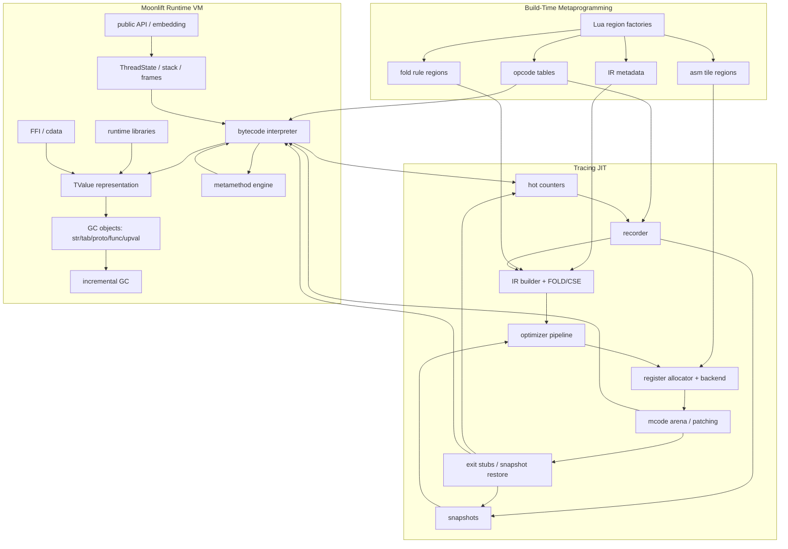

---

## 4. Execution Tiers

| Tier | Name | Implementation | Role |
|---|---|---|---|
| 0 | Build/meta | Lua + Moonlift parser | generate monomorphic Moonlift regions and constants |
| 1 | Interpreter | Moonlift native code | complete semantics, profiling, trace entry |
| 2 | Trace compiler | Moonlift native code | record/optimize/assemble hot traces |
| 3 | Machine traces | generated native code | optimized hot paths |

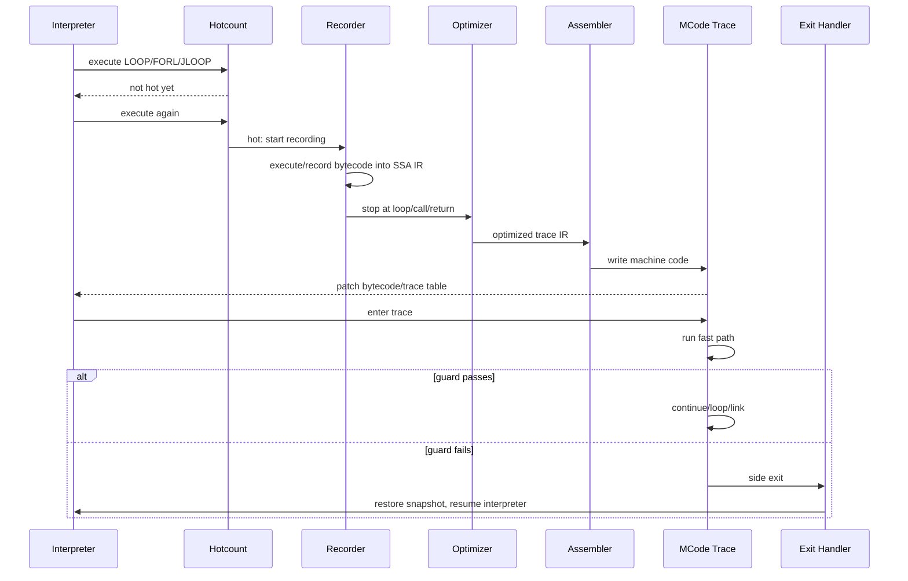

---

## 5. Repository Layout Proposal

```text
mlua/luajitvm/
  core/
    value.mlua          TValue representation helpers
    object.mlua         GC headers and object layouts
    state.mlua          GlobalState, ThreadState, frames
    bytecode.mlua       BCIns, opcode definitions, decoders
    api.mlua            sealed public API functions
  runtime/
    dispatch.mlua       vm_loop and opcode dispatch
    arith.mlua          arithmetic/comparison handlers
    table.mlua          table lookup/store regions
    call.mlua           call/return/tailcall regions
    meta.mlua           metamethod lookup/call regions
    string.mlua         string operations/interning
    upvalue.mlua        open/closed upvalue regions
    error.mlua          runtime error/protected-call regions
  gc/
    gc.mlua             GC state machine
    alloc.mlua          allocation regions
    barrier.mlua        write barriers
    mark.mlua           marking/propagation
    sweep.mlua          sweeping/finalization
  jit/
    trace.mlua          trace lifecycle and hot counters
    record.mlua         recorder top-level
    rec_*.mlua          recorder opcode families
    ir.mlua             IRIns/TRef/REF_BIAS helpers
    emit.mlua           IR emitter + CSE chains
    fold.mlua           generated fold dispatcher
    snap.mlua           snapshot capture/restore
    opt_dce.mlua
    opt_loop.mlua
    opt_sink.mlua
    opt_split.mlua
    opt_narrow.mlua
  asm/
    asm_state.mlua      AsmState, RegSet, spill slots
    mcode.mlua          mcode arena management
    x64_emit.mlua       x64 byte encoders
    x64_tiles.mlua      generated asm tile regions
    x64_exit.mlua       exit stubs
    regalloc.mlua       register allocator regions
  ffi/
    ctype.mlua          CType model
    cdata.mlua          cdata operations
    ccall.mlua          ABI lowering and calls
  generated/
    opcodes.mlua        generated from Lua metadata
    ir_meta.mlua        generated IR metadata
    fold_rules.mlua     generated fold rule regions
    asm_tiles_x64.mlua  generated tile dispatch
```

---

## 6. Runtime Type Forest

### 6.1 TValue

The VM needs LuaJIT-compatible dynamic values.

Initial implementation may use explicit `{tag, payload}` structs for clarity,
but the final ABI should support NaN-boxing or GC64-style tagging.

Logical TValue kinds:

| Tag | Payload | Notes |
|---|---|---|
| nil | none | singleton |
| false | none | singleton |
| true | none | singleton |
| int | i32/i64 | dual-number mode policy must be chosen |
| num | f64 | IEEE double |
| lightuserdata | raw pointer | non-GC pointer |
| string | `ptr(GCstr)` | interned immutable string |
| table | `ptr(GCtab)` | array + hash parts |
| function | `ptr(GCfunc)` | Lua or native function |
| thread | `ptr(GCthread)` | coroutine/thread |
| userdata | `ptr(GCudata)` | GC object with payload |
| cdata | `ptr(GCcdata)` | FFI object |

TValue design requirements:

1. Fast tag tests from interpreter and generated traces.
2. Stable layout visible to snapshot restore.
3. Efficient register passing in compiled traces.
4. Exact GC object pointer identification.
5. Compatible with FFI/cdata values.

### 6.2 GC Object Header

All collectable objects share a prefix:

```text
GCHeader:
  next: ptr(GCobj)
  marked: u8
  gct: u8
```

Object forest:

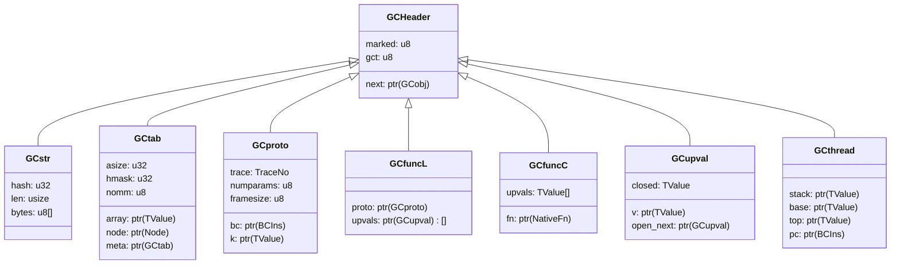

### 6.3 Global and Thread State

```text
GlobalState:
  strtab                string intern table
  registry              registry table
  main_thread           ptr(GCthread)
  allgc                 intrusive list of all GC objects
  gray, grayagain       GC marking lists
  weak, ephemeron       weak table lists
  finalizers            finalization queue
  currentwhite          active white bits
  gcstate               pause/propagate/atomic/sweep/finalize
  totalbytes, threshold allocation accounting
  trace[]               trace table
  dispatch[]            interpreter/trace dispatch table
  mcode_areas           machine-code memory arenas
  jit_params            JIT parameter table

ThreadState:
  g                     ptr(GlobalState)
  stack                 ptr(TValue)
  stack_size            u32
  base                  ptr(TValue)
  top                   ptr(TValue)
  pc                    ptr(BCIns)
  frame                 frame marker encoded in stack or explicit CallInfo
  openupval             ptr(GCupval)
  status                running/yielded/dead/error
```

---

## 7. Bytecode Architecture

The VM may use LuaJIT's bytecode shape or a Moonlift-defined equivalent. To stay
LuaJIT-grade and compatible with known tracing architecture, use a compact
32-bit instruction:

```text
BCIns: u32
  op: u8
  A:  u8
  B:  u8
  C:  u8
or
  op: u8
  A:  u8
  D:  u16
```

Opcode families:

| Family | Examples | Notes |
|---|---|---|
| constants/moves | KPRI, KINT, KGC, MOV | stack register VM |
| unary/binary arith | ADD, SUB, MUL, DIV, MOD, POW, UNM | fast numeric paths + metamethods |
| comparisons | ISLT, ISGE, ISEQV, ISNEV | branch pairing with JMP |
| table | TGETV, TGETS, TGETB, TSETV, TSETS, TSETB | fast table paths |
| calls | CALL, CALLM, CALLT, ITERC | variable results |
| returns | RET, RET0, RET1 | frame unwind |
| loops | LOOP, FORI, FORL, ITERL, JLOOP | hotcount points |
| closures | FNEW, UCLO, UGET, USET | upvalue management |
| vararg | VARG | stack shuffle |

The interpreter and recorder share opcode metadata but have different handler
regions.

---

## 8. Region Programming Model for the VM

### 8.0 Compiler Boundary: Region Normal Form

Region composition is normalized by a dedicated compiler pass/module:

```text
open Moonlift region source
  -> open expansion of values/types/names
  -> RNF: import emitted fragments into one explicit CFG
  -> control validation/typecheck
  -> BackCmd lowering
```

Implementation: `lua/moonlift/region_normal_form.lua`.

RNF owns:

- emitted fragment block import;
- alpha-renaming imported labels;
- runtime parameter capture and rebinding;
- continuation fill routing;
- replacement of emit sites with entry jumps;
- block hoisting;
- recursive emit cycle rejection.

After RNF, executable control regions should contain no lowerable
`StmtUseRegionFrag` nodes.

### 8.1 Canonical Region Shape

The preferred form uses a named protocol type:

```moonlift
type TableGet = hit(val: TValue) | nil_no_meta() | meta(mm: TValue) | error(kind: RuntimeErrorKind)

region table_get(G: ptr(GlobalState), tab: ptr(GCtab), key: TValue) -> TableGet
```

For one-off local regions without a named family, inline continuations
are still valid:

```moonlift
region fragment(inputs...;
    fast: cont(...),
    slow: cont(...),
    error: cont(code: i32))
```

Rules (apply to both forms):

1. All exits are named and typed.
2. No hidden nullable returns for control events.
3. No hidden global error path.
4. `emit` composes regions into one CFG.
5. Blocks are local states with typed parameters.

### 8.2 Region Protocol Table

All VM subsystem protocols are defined as named tagged-union types and
catalogued in `docs/VM_PROTOCOL_DESIGN.md`.

| Subsystem | Protocol type | Key exits |
|---|---|---|
| interpreter top | `InterpResult` | `returned`, `yielded`, `error` |
| opcode handler | `OpcodeResult` | `next`, `hot`, `yield`, `error` |
| table get | `TableGet` | `hit`, `nil_no_meta`, `meta`, `error` |
| table set | `TableSet` | `done`, `need_barrier`, `new_key`, `meta`, `error` |
| call setup | `CallResult` | `lua_call`, `native_call`, `metamethod`, `error` |
| return | `ReturnResult` | `resume_caller`, `final_return`, `close_upvalues`, `error` |
| metamethod | `MetamethodResult` | `found`, `not_found`, `error` |
| allocation | `AllocResult` | `ok`, `step`, `oom` |
| GC step | `GCStepResult` | `done`, `need_finalize`, `oom`, `error` |
| GC barrier | `BarrierResult` | `done` |
| trace record root | `TraceRecord` | `compiled`, `interpret`, `abort` |
| trace record side | `TraceRecordSide` | `compiled`, `stitch`, `interpret`, `abort` |
| trace commit | `TraceCommit` | `root_patched`, `side_patched`, `abort` |
| IR emit | `IREmit` | `result`, `retry`, `need_snapshot`, `overflow`, `abort` |
| FOLD | `FoldResult` | `replace`, `emit`, `retry`, `abort` |
| slot access | `SlotGet` | `have`, `need_sload`, `abort` |
| snap add | `SnapAdd` | `done`, `merge`, `overflow`, `abort` |
| snap restore | `SnapRestore` | `restored`, `unsupported`, `error` |
| optimizer | `OptResult` | `optimized`, `retry_recording`, `abort` |
| assembler | `AsmResult` | `mcode`, `retry_realign`, `retry_ir_grew`, `mcode_full`, `abort` |
| tile dispatch | `TileResult` | `done`, `need_snapshot`, `mcode_full`, `abort` |
| register alloc | `RAAlloc` | `reg`, `remat`, `spill_and_retry`, `fail` |
| hot exit | `HotExit` | `resume_interp`, `start_side`, `blacklist`, `error` |
| parse exit | `ParseExit` | `ok`, `fail` |

Abort reasons for `abort(reason: TraceAbort)` are themselves a typed data
union matching the full LuaJIT `lj_traceerr.h` TREDEF table — see
`docs/VM_PROTOCOL_DESIGN.md §3`.

---

## 9. Interpreter Architecture

### 9.1 Main Dispatch Region

The interpreter is a switch-driven hot loop sealed inside a function.

```moonlift
func vm_resume(L: ptr(ThreadState), resume_status: i32) -> i32
    emit vm_loop(L, resume_status;
        returned = ret_returned,
        yielded  = ret_yielded,
        error    = ret_error)
end
```

```moonlift
region vm_loop(L: ptr(ThreadState), status: i32) -> InterpResult
entry dispatch()
    let bc: i32 = load(L.pc)
    let op: i32 = bc & 0xFF
    switch op
    case BC_ADD then
        emit vm_bc_add(L, bc; next=dispatch, hot=enter_trace, error=error)
    end
    case BC_TGETV then
        emit vm_bc_tgetv(L, bc; next=dispatch, hot=enter_trace, error=error)
    end
    case BC_CALL then
        emit vm_bc_call(L, bc; next=dispatch, hot=enter_trace, yield=yielded, error=error)
    end
    case BC_RET then
        emit vm_bc_ret(L, bc; resume_caller=dispatch, final_return=returned, close_upvalues=close_upvals, error=error)
    end
    case BC_LOOP then
        emit vm_bc_loop(L, bc; next=dispatch, hot=enter_trace, error=error)
    end
    case BC_JLOOP then
        emit vm_bc_jloop(L, bc; next=dispatch, hot=enter_trace, error=error)
    end
    default then
        jump error(kind = type_error(0, 0))
    end
block enter_trace(pc: ptr(BCIns))
    emit trace_enter(L, pc; next=dispatch, returned=returned, error=error)
end
block close_upvals(from: ptr(TValue))
    emit upvalue_close(L, from; done=dispatch, error=error)
end
end
```

### 9.2 Opcode Handler Families

#### Arithmetic

```moonlift
region vm_bc_add(L: ptr(ThreadState), bc: i32) -> OpcodeResult
```

States:

1. Decode A/B/C.
2. Load operands from stack.
3. Fast integer/number path.
4. Overflow/conversion path if configured.
5. Metamethod `__add` path.
6. Store result.
7. Advance PC.

#### Table Get

```moonlift
region vm_bc_tgetv(L: ptr(ThreadState), bc: i32) -> OpcodeResult
```

States:

1. Check base is table.
2. Fast array/hash lookup.
3. If miss, check `__index`.
4. If function metamethod, call.
5. If table metamethod, retry lookup.
6. Store result.

#### Call

```moonlift
region vm_bc_call(L: ptr(ThreadState), bc: i32) -> OpcodeResult
```

States:

1. Decode function slot, nargs, nresults.
2. Resolve callable or `__call` metamethod.
3. Lua function: push frame and jump dispatch.
4. Native function: protected ABI call.
5. Coroutine/yield handling.
6. Error path.

### 9.3 Call/Return State Diagram

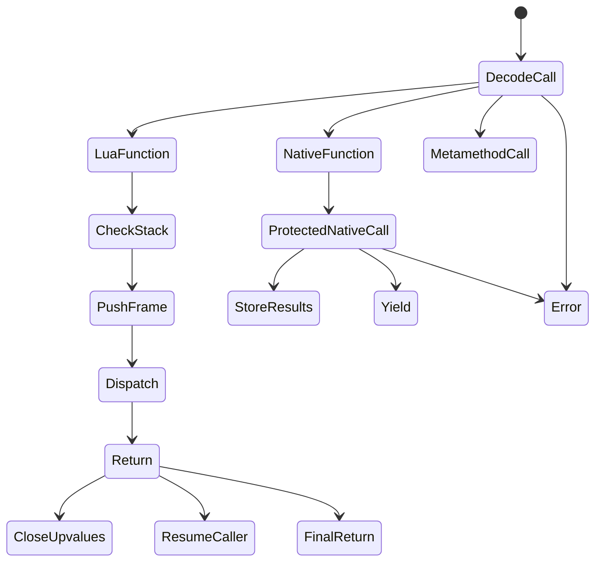

---

## 10. Tables, Metamethods, and Runtime Fast Paths

### 10.1 Table Lookup Protocol

```moonlift
region table_get(G: ptr(GlobalState), tab: ptr(GCtab), key: TValue) -> TableGet
```

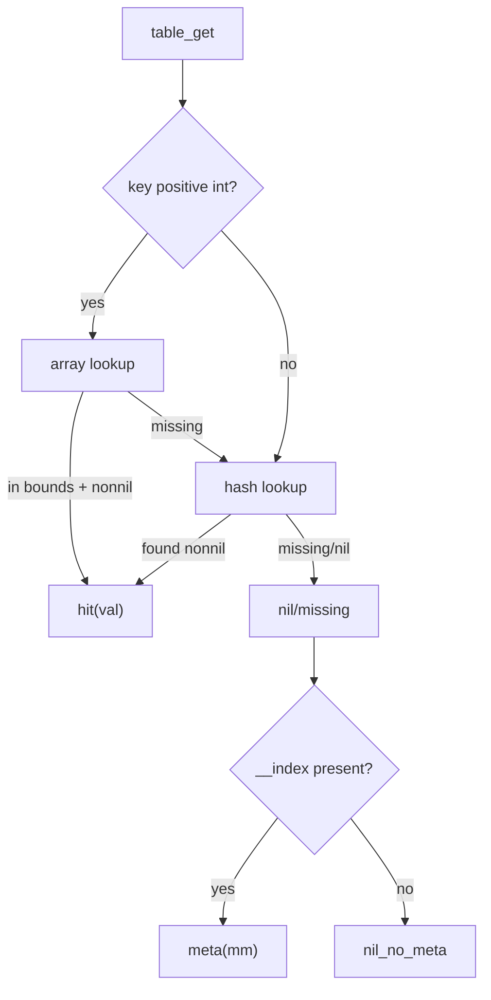

### 10.2 Table Store Protocol

```moonlift
region table_set(G: ptr(GlobalState), tab: ptr(GCtab), key: TValue, val: TValue) -> TableSet
```

The GC barrier is not hidden in the store. It is a typed exit that must be
handled by every caller.

### 10.3 Metamethod Engine

```moonlift
region metamethod_binop(L: ptr(ThreadState), mm: i32, lhs: TValue, rhs: TValue) -> MetamethodResult
```

Metamethod lookup uses per-table negative caches (`nomm`) like LuaJIT. Recorder
regions model the same fast/slow paths and insert guards for assumptions.

---

## 11. Garbage Collector Architecture

### 11.1 GC State Machine

Use an incremental tri-color collector, LuaJIT-style.

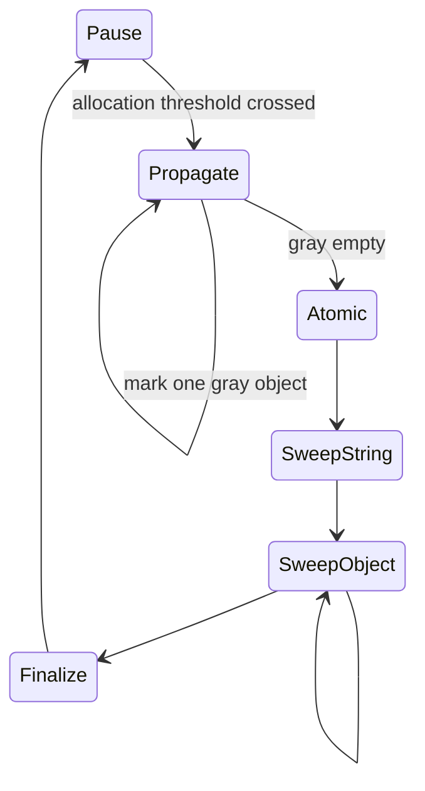

### 11.2 GC Regions

```moonlift
region gc_alloc(G: ptr(GlobalState), size: usize, gct: i32) -> AllocResult
```

```moonlift
region gc_step(G: ptr(GlobalState), budget: i32) -> GCStepResult
```

```moonlift
region gc_barrier_fwd(G: ptr(GlobalState), parent: ptr(GCobj), child: TValue) -> BarrierResult
```

```moonlift
region gc_barrier_back(G: ptr(GlobalState), tab: ptr(GCtab)) -> BarrierResult
```

### 11.3 GC Invariants

1. No black object may point to a white object without barrier repair.
2. Every object allocation initializes header before any possible GC step.
3. Every TValue store into a GC object routes through a barrier-aware region.
4. Snapshot restore must produce GC-visible valid stack state before resuming.
5. MCode traces that allocate must call allocation helpers with safepoints.

---

## 12. Trace Lifecycle

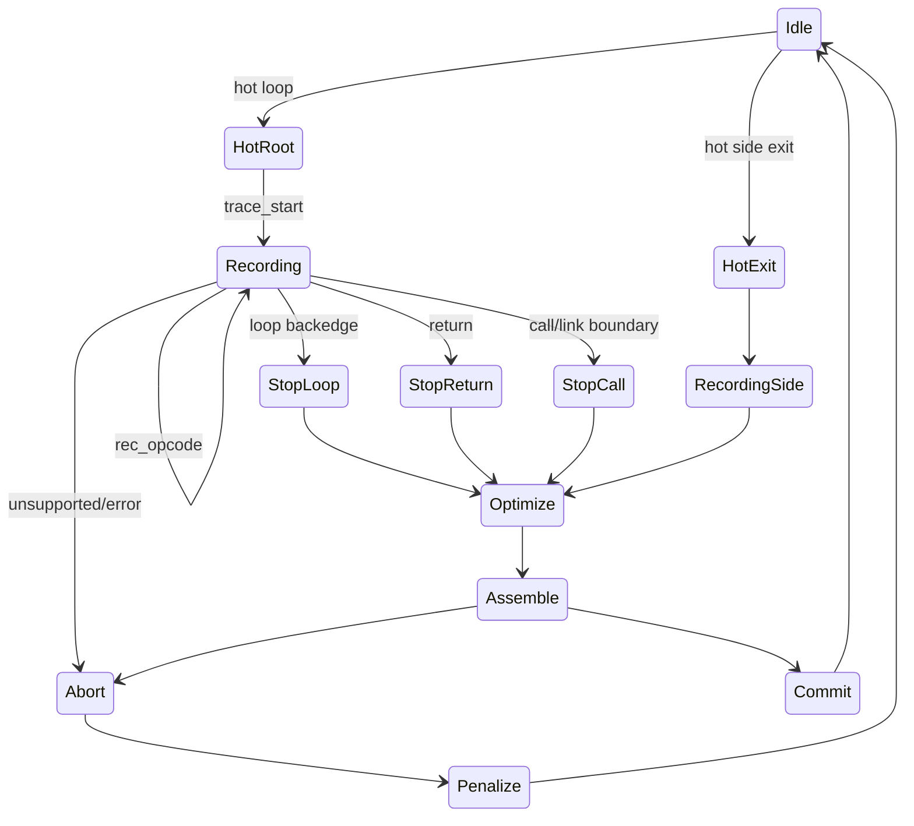

### 12.1 Trace Start

```moonlift
region trace_start(J: ptr(JitState), L: ptr(ThreadState), pc: ptr(BCIns), parent: i32, exitno: i32) -> TraceRecord
```

Responsibilities:

- initialize current trace;
- initialize IR buffer with `BASE`;
- initialize slot map;
- capture parent side-trace context if any;
- seed first snapshot if needed.

### 12.2 Recording Root

```moonlift
region trace_record_root(J: ptr(JitState), L: ptr(ThreadState), pc: ptr(BCIns)) -> TraceRecord
```

### 12.3 Recording Side Trace

```moonlift
region trace_record_side(J: ptr(JitState), L: ptr(ThreadState), parent: i32, exitno: i32) -> TraceRecordSide
```

### 12.4 Trace Commit

```moonlift
region trace_commit(J: ptr(JitState), tr: i32, mcode_entry: ptr(u8)) -> TraceCommit
```

Commit updates:

- trace table;
- prototype root trace chain;
- parent side trace chain;
- bytecode patch (`LOOP -> JLOOP`, etc.);
- mcode link branches.

---

## 13. SSA IR Architecture

Use LuaJIT's proven low-level model.

### 13.1 IRIns Layout

```text
IRIns: 64 bits
  op1:u16
  op2:u16
  t:u8
  o:u8
  r:u8
  s:u8

During recording:
  r+s overlap prev:u16 for CSE chain.

During assembly:
  r = register assignment
  s = spill slot
```

### 13.2 Ref Space

```text
Constants grow downward below REF_BIAS.
Instructions grow upward from REF_BIAS.

ref < REF_BIAS  => constant
ref >= REF_BIAS => instruction
```

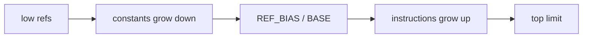

### 13.3 TRef

```text
TRef = (IRType << 24) | IRRef
```

This is kept because it makes recorder type checks cheap and matches LuaJIT's
successful design.

### 13.4 IR Opcode Families

| Family | Examples |
|---|---|
| constants | KPRI, KINT, KGC, KPTR, KNUM, KINT64 |
| guards | LT, GE, EQ, NE, ABC, RETF |
| meta | NOP, BASE, LOOP, PHI, RENAME, USE |
| memory refs | AREF, HREFK, HREF, UREF, FREF, STRREF |
| loads | SLOAD, ALOAD, HLOAD, ULOAD, FLOAD, XLOAD |
| stores | ASTORE, HSTORE, USTORE, FSTORE, XSTORE |
| arithmetic | ADD, SUB, MUL, DIV, MOD, NEG, ABS, MIN, MAX |
| overflow | ADDOV, SUBOV, MULOV |
| calls | CALLN, CALLA, CALLL, CALLS, CALLXS |
| allocations | TNEW, TDUP, CNEW, CNEWI, SNEW |
| barriers | TBAR, OBAR, XBAR |
| conversions | CONV, TOBIT, TOSTR, STRTO |

---

## 14. IR Builder, FOLD, and CSE

### 14.1 Emit Protocol

```moonlift
region ir_emit(J: ptr(JitState), ot: i32, a: i32, b: i32) -> IREmit
```

### 14.2 FOLD State Machine

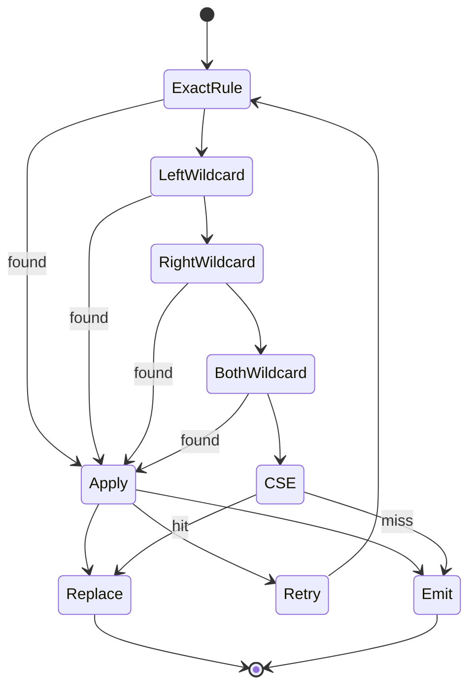

### 14.3 Fold Rule Regions

Fold rules are generated by Lua at build time as concrete Moonlift regions.

```moonlift
region fold_add_kint_kint(J: ptr(JitState), ot: i32, a: i32, b: i32) -> FoldResult
```

The generated dispatcher is a switch/tree over opcode and operand classes. The
compiled VM contains no dynamic Lua rule engine.

---

## 15. Recorder Architecture

### 15.1 Recorder Mirrors Interpreter Semantics

The recorder must encode exactly the same semantics as the interpreter, but as
SSA IR and guards.

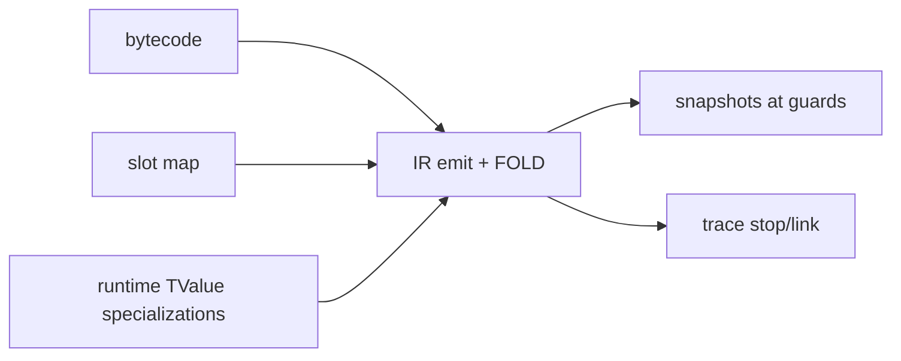

### 15.2 Recorder Opcode Protocol

```moonlift
region rec_bc_add(J: ptr(JitState), L: ptr(ThreadState), bc: i32) -> RecOpcodeResult
```

```moonlift
region rec_bc_tgetv(J: ptr(JitState), L: ptr(ThreadState), bc: i32) -> RecTableGet
```

```moonlift
region rec_bc_call(J: ptr(JitState), L: ptr(ThreadState), bc: i32) -> RecCallResult
```

### 15.3 Slot Map

```text
J.slot[stack_slot] -> TRef
```

Protocol:

```moonlift
region rec_getslot(J: ptr(JitState), L: ptr(ThreadState), slot: i32) -> SlotGet
```

First access emits `SLOAD` with a type guard. Subsequent access reuses the slot
map.

---

## 16. Snapshots and Deoptimization

### 16.1 Snapshot Data

```text
SnapShot:
  mapofs: u32
  ref: IRRef
  mcofs: u32/u16
  nslots: u8
  topslot: u8
  nent: u8/u16
  count: u8

SnapEntry:
  slot:u8 + flags + ref:u16
```

### 16.2 Capture Protocol

```moonlift
region snap_add(J: ptr(JitState), guard: i32) -> SnapAdd
```

### 16.3 Restore Protocol

```moonlift
region snap_restore(L: ptr(ThreadState), tr: i32, exitno: i32, ex: ptr(ExitState)) -> SnapRestore
```

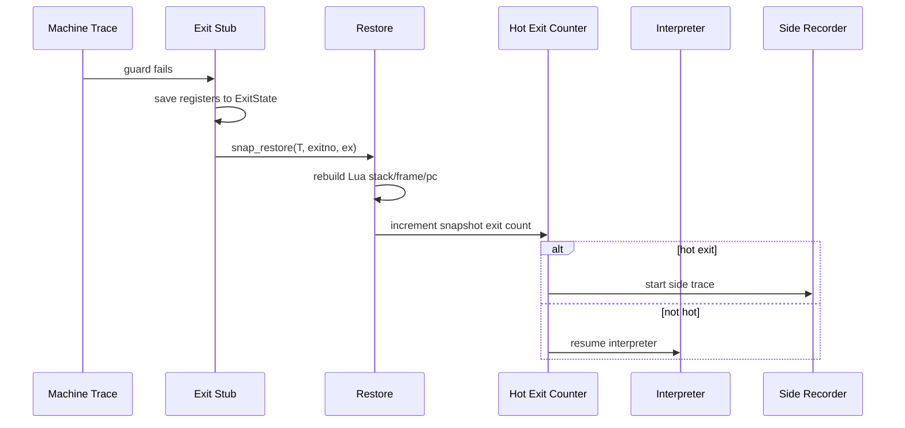

---

## 17. Optimizer Pipeline

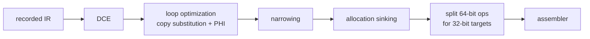

### 17.1 Optimize Trace Region

```moonlift
region optimize_trace(J: ptr(JitState), tr: i32) -> OptResult
```

### 17.2 DCE

Mark from snapshots and side effects, then walk backwards.

```moonlift
region opt_dce(J: ptr(JitState), tr: i32) -> DCEResult
```

### 17.3 Loop Optimization

LuaJIT's loop optimizer is copy-substitution unrolling with PHI insertion.

```moonlift
region opt_loop(J: ptr(JitState), tr: i32) -> LoopOptResult
```

States:

1. detect loop trace;
2. classify invariant/variant refs;
3. build substitution table;
4. re-emit variant body;
5. create PHI nodes;
6. rewrite snapshots.

### 17.4 Sinking

```moonlift
region opt_sink(J: ptr(JitState), tr: i32) -> SinkResult
```

Allocation sinking makes allocations virtual until a side exit requires
materialization.

---

## 18. Assembler and Register Allocation

### 18.1 Assembler Overview

The assembler walks IR backwards, allocating registers and emitting machine code.

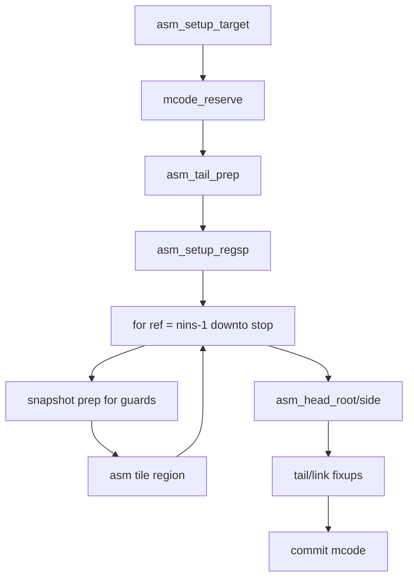

### 18.2 Top-Level Region

```moonlift
region asm_trace(J: ptr(JitState), tr: i32) -> AsmResult
```

### 18.3 Register Allocator Protocols

```moonlift
region ra_alloc(A: ptr(AsmState), ref: i32, allow: i32) -> RAAlloc
```

```moonlift
region ra_dest(A: ptr(AsmState), ref: i32, allow: i32) -> RADest
```

### 18.4 Tile Dispatch

```moonlift
region x64_asm_one_ir(A: ptr(AsmState), ref: i32) -> TileResult
entry start()
    let op: i32 = ir_op(A, ref)
    switch op
    case IR_ADD then
        emit x64_ir_add(A, ref; done=done, mcode_full=mcode_full, abort=abort)
    end
    case IR_SLOAD then
        emit x64_ir_sload(A, ref; done=done, need_snapshot=need_snapshot, mcode_full=mcode_full, abort=abort)
    end
    case IR_HLOAD then
        emit x64_ir_hload(A, ref; done=done, mcode_full=mcode_full, abort=abort)
    end
    case IR_EQ then
        emit x64_ir_guard_eq(A, ref; done=done, need_snapshot=need_snapshot, mcode_full=mcode_full, abort=abort)
    end
    default then
        jump unsupported(op = op)
    end
end
end
```

---

## 19. Machine Code Memory and Patching

### 19.1 MCode Arena

```text
MCodeArea:
  next: ptr(MCodeArea)
  size: usize
  bot: ptr(MCode)
  top: ptr(MCode)
  limit: ptr(MCode)
```

### 19.2 Allocation Protocol

```moonlift
region mcode_reserve(J: ptr(JitState), need: usize) -> MCodeReserve
```

### 19.3 Patch Protocols

```moonlift
region patch_trace_link(J: ptr(JitState), from: i32, to: i32) -> PatchBranch
```

```moonlift
region emit_exit_stub(A: ptr(AsmState), exitno: i32) -> ExitStubResult
```

MCode code emission must never silently invalidate pointers. If alignment,
capacity, or IR growth forces retry, it exits through typed continuations.

---

## 20. Side Traces

Side traces begin at hot guard exits.

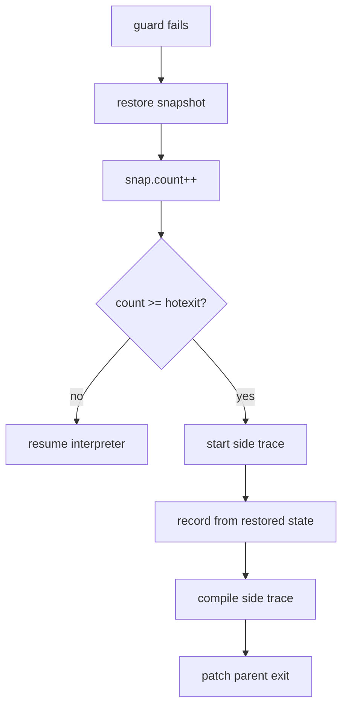

Region:

```moonlift
region hot_side_exit(J: ptr(JitState), L: ptr(ThreadState), parent: i32, exitno: i32) -> HotExit
```

---

## 21. FFI Architecture

A LuaJIT-grade VM includes FFI.

### 21.1 CType System

```text
CType:
  primitive integer/float
  pointer
  array
  struct
  union
  enum
  function
  vector
  complex

CTypeState:
  type table
  name table
  layout cache
  ABI classification cache
```

### 21.2 CData Regions

```moonlift
region cdata_index(L: ptr(ThreadState), cd: ptr(GCcdata), key: TValue) -> CDataIndex
```

```moonlift
region cdata_store(L: ptr(ThreadState), cd: ptr(GCcdata), key: TValue, val: TValue) -> TableSet
```

### 21.3 C Call Regions

```moonlift
region ffi_prepare_call(L: ptr(ThreadState), cfun: ptr(u8), args: ptr(TValue), nargs: i32) -> FFIPrepCall
```

```moonlift
region ffi_emit_call(A: ptr(AsmState), ci: ptr(u8)) -> FFIEmitCall
```

FFI can be implemented after core tracing, but its layout constraints must be
reserved early.

---

## 22. Error Handling and Trace Abort

### 22.1 Runtime Error Protocol

```moonlift
region runtime_error(L: ptr(ThreadState), kind: RuntimeErrorKind) -> RuntimeError
```

### 22.2 Trace Abort Protocol

```moonlift
region trace_abort_handler(J: ptr(JitState), reason: TraceAbort) -> HotExit
```

Trace aborts are not exceptions in compiler internals. Every compiler region
that can fail has an explicit `abort(reason: TraceAbort)` exit. `TraceAbort`
is a typed data union — see `docs/VM_PROTOCOL_DESIGN.md §3`.

---

## 23. Generated Architecture Tables

Build-time Lua produces static Moonlift definitions.

| Artifact | Generated output |
|---|---|
| opcode metadata | enum, names, operand modes, interpreter dispatch cases |
| recorder metadata | opcode -> recorder handler mapping |
| IR metadata | opcode modes, side-effect flags, type families |
| fold rules | region definitions + dispatcher |
| asm tiles | backend-specific tile dispatch |
| runtime helper table | helper IDs, call ABI metadata |
| metamethod table | interned names, negative cache masks |
| ctype primitives | primitive CType IDs and ABI classes |

This replaces C macro DSLs with typed ASDL/region construction.

---

## 24. Bootstrap Strategy

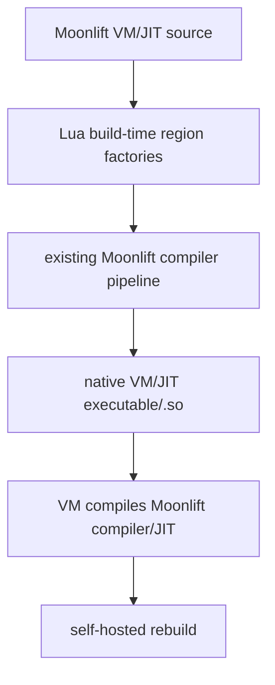

Phases:

1. Use current Moonlift/LuaJIT-hosted pipeline to compile the VM/JIT once.
2. The produced native VM can run the Moonlift compiler frontend/runtime.
3. The Moonlift JIT backend compiles itself.
4. Lua becomes build-time-only or removable for the runtime path.

---

## 25. Implementation Milestones With Final Shapes

The implementation can be staged, but each stage must use final data layouts and
region protocols.

| Milestone | Deliverable | Constraint |
|---|---|---|
| M0 | all protocol types declared in `mlua/luajitvm/protocols.mlua` | **no region implements a protocol not in this file** |
| M1 | architecture + generated metadata skeleton | final region signatures committed |
| M1 | TValue/object/state layouts | no toy stack/value model |
| M2 | interpreter for core Lua bytecode | switch dispatch, region handlers |
| M3 | GC allocation + barriers | real object allocation discipline |
| M4 | trace IR builder + FOLD skeleton | LuaJIT-like IRIns/TRef/REF_BIAS |
| M5 | root trace recording for numeric loops | real snapshots, real deopt path |
| M6 | DCE + loop optimization | PHI/copy-substitution architecture |
| M7 | x64 assembler + mcode arena | real exit stubs and patching |
| M8 | side traces | hot exits, parent patching |
| M9 | tables/metamethod recording | real Lua semantics |
| M10 | closures/upvalues/coroutines | frame/upvalue correctness |
| M11 | FFI/cdata/ccall | ABI lowering |
| M12 | self-host bootstrap experiment | VM compiles its own compiler/JIT |

---

## 26. Non-Negotiable Invariants

1. **Protocol types first:** every subsystem exit boundary is a named tagged-union type in `protocols.mlua` before any region implements it.
2. **Typed exits only:** every meaningful control exit is a continuation.
3. **Switch dispatch:** interpreter opcode dispatch is a switch, not an if-chain.
3. **No hidden null control:** nullable pointers are not used for miss/error/oom
   in hot VM infrastructure.
4. **Final IR shape:** LuaJIT-like `IRIns`, `TRef`, `REF_BIAS` from the start.
5. **Snapshots are the only deopt contract:** every machine-code exit restores
   through snapshot metadata.
6. **Every guard has a snapshot or a static proof that it cannot exit.**
7. **Stores route through barrier-aware regions.**
8. **MCode retries are explicit:** capacity/alignment/IR-growth retry exits.
9. **Recorder mirrors interpreter semantics.** Fast paths must have slow semantic
   equivalents.
10. **No Lua in runtime hot path.** Lua is only the build-time metaprogramming
    layer.
11. **Region composition is primary.** Functions seal external boundaries only.
12. **Implementation may be partial, but layouts and protocols are not toy.**

---

## 27. Open Design Questions

These must be resolved before coding the low-level core.

| Question | Status | Decision |
|---|---|---|
| TValue representation | **decided** | explicit tag/payload struct first; NaN-boxing behind helper regions later |
| number mode | open | dualnum vs always-f64+int |
| bytecode source | open | LuaJIT-compatible vs Moonlift-defined |
| GC exactness | open | incremental tri-color first (final) or bump-only bring-up |
| backend target first | **decided** | x64 first; arm64 later |
| C API compatibility | open | Lua 5.1 subset or internal-only first |
| FFI scope | open | full FFI vs staged ccall/cdata |
| coroutine model | open | full yield or staged |
| protocol types location | **decided** | `mlua/luajitvm/protocols.mlua` is M0, all types declared before any implementation |

Decisions made:

1. LuaJIT-style `IRIns/TRef/REF_BIAS` permanently (D002).
2. Explicit-tag TValue for bring-up, NaN-boxing behind helper regions (D004 candidate).
3. x64 first (D004).
4. Final snapshot format from the start.
5. GC barrier continuations from day one.
6. Named protocol exit syntax implemented in Moonlift parser (D006).
7. VM protocol catalog in `docs/VM_PROTOCOL_DESIGN.md` (D007).

---

## 28. Assembler Reuse Strategy

The raw assembler/backend is the scariest part of the project. LuaJIT's backend
contains two distinct bodies of architecture-specific low-level code:

| Part | LuaJIT files | Purpose | Reuse decision |
|---|---|---|---|
| VM assembly glue | `vm_x64.dasc`, `vm_arm64.dasc`, etc. | interpreter entry, exits, helper stubs, ABI glue | use as reference; replace most with Moonlift/native ABI stubs |
| Trace assembler | `lj_asm.c`, `lj_asm_x86.h`, `lj_asm_arm64.h`, etc. | IR → machine code, integrated register allocation, guard exits | port architecture and selected encodings; do not depend on C backend long-term |

### 28.1 Why Not Just Vendor `lj_asm.c`?

`lj_asm.c` is not a standalone backend. It depends on:

- LuaJIT's exact `IRIns`, `GCtrace`, `SnapShot`, `jit_State`, and `ASMState`;
- LuaJIT's `TValue` and GC object layout;
- runtime helper ABI and dispatch table globals;
- target macros from `lj_target.h`;
- mcode allocator and trace patching internals;
- C preprocessor inclusion of architecture headers like `lj_asm_x86.h`;
- C call metadata (`IRCALL`, `CCallInfo`) and FFI ABI classification.

Using only `lj_asm.c` would quickly drag in half of LuaJIT. It would also freeze
our runtime layout to LuaJIT's C internals, which defeats the point of a
Moonlift-native VM.

### 28.2 What We Should Reuse

LuaJIT is MIT-licensed, so code reuse is legally possible if the license and
copyright notices are preserved. But architecturally the better plan is:

1. **Reuse the design.** Keep the backward assembler, integrated register
   allocator, spill/rematerialization model, mcode arenas, snapshots, and exit
   stubs.
2. **Use LuaJIT as an oracle.** Compare emitted traces, disassembly, register
   allocation behavior, and guard/exit layouts during development.
3. **Port selected encoding helpers.** x64 and arm64 instruction encodings can be
   translated into Moonlift region factories/tables.
4. **Avoid final C dependency.** A temporary C backend is acceptable only as a
   bootstrap/testing aid, not as the final VM backend.

### 28.3 Backend Plan

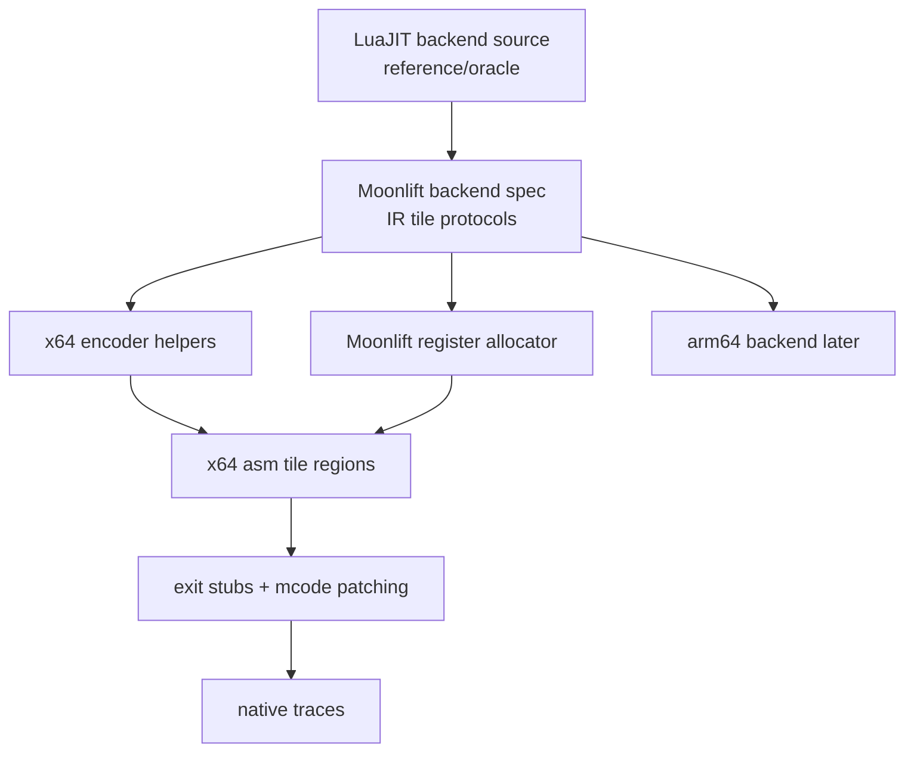

The first real backend target should be **x64 only**. Arm64 should be designed
for, but not implemented until the backend protocol survives x64.

### 28.4 Backend Interface Boundary

All target backends implement the same region protocol:

```moonlift
region asm_trace_target(A: ptr(AsmState), tr: i32) -> AsmResult
```

Target-specific tile dispatch remains isolated:

```moonlift
region x64_asm_one_ir(A: ptr(AsmState), ref: i32) -> TileResult
```

### 28.5 Practical Rule

Do not copy `lj_asm.c` as a dependency unless we deliberately create a temporary
experimental backend. The final architecture should be a Moonlift backend that
is **LuaJIT-shaped**, not LuaJIT-linked.

The acceptable forms of reuse are:

- reading and documenting algorithms;
- translating small encoding routines with attribution;
- generating equivalent tile tables;
- comparing output against LuaJIT;
- keeping a vendored LuaJIT checkout as a reference.

---

## 29. Summary

The future VM is a complete LuaJIT-grade runtime and tracing JIT written in
Moonlift. Its distinguishing feature is not that it uses a nicer syntax than C.
Its distinguishing feature is that LuaJIT's implicit control machines become
explicit typed region graphs.

```text
LuaJIT C:
  flags + mutable state + macros + return codes + longjmp

Moonlift VM:
  named protocol types + typed region exits + block states + emit composition
```

Every LuaJIT implicit protocol — recorder stop/abort, FOLD retry/replace,
snapshot capture/restore, mcode reservation/retry, GC barrier, side-exit hot
counting — becomes a named tagged-union type. The types are declared once.
Every region either satisfies one of those types or is a one-off local fragment.
The full catalog is in `docs/VM_PROTOCOL_DESIGN.md`.

The low-level data structures remain brutal and precise: TValue layouts, GC
headers, SSA IR buffers, snapshots, mcode arenas, register sets. Moonlift does
not remove the need for careful systems design. It gives the control graph a type
system, which is exactly where a tracing JIT needs help most.
